# Markor - News

## General

### Installation
You can install and update from [F-Droid](https://f-droid.org/repository/browse/?fdid=net.gsantner.markor) or [GitHub](https://github.com/gsantner/markor/releases/latest).

F-Droid is a store for free & open source apps.
The *.apk's available for download are signed by the F-Droid team and guaranteed to correspond to the (open source) source code of Markor.
Generally this is the recommended way to install Markor & keep it updated.


### Get informed
* Check the [project readme](https://github.com/gsantner/markor/tree/news#readme) for general project information.
* Check the [project news](https://github.com/gsantner/markor/blob/master/NEWS.md#readme) for more details on what is going on.
* Check the [project git history](https://github.com/gsantner/markor/commits/master) for most recent code changes.

### The right place to ask
If you have questions or found an issue please head to the [Markor project](https://github.com/gsantner/markor/issues/new/choose) and ask there. 
[Search](https://github.com/gsantner/markor/issues?q=#js-issues-search) for same/similar and related issues/questions before, it might be already answered or resolved.   


## Navigation
* [**README**](README.md)
  * [Features](README.md#features)
  * [Contribute](README.md#contribute)
  * [Develop](README.md#develop)
  * [Privacy](README.md#privacy)
  * [License](README.md#license)
* [**FAQ**](README.md#FAQ)
  * [File browser, file management](README.md#file-browser--file-management)
  * [Format: Markdown](README.md#format-markdown)
  * [Format: todo.txt](README.md#format-todotxt)
* [**More**](doc)
  * [Synced plaintext TODO and notes - Vim / Vimwiki, Markor Android, Syncthing, GTD (Pitt)](doc/2020-09-26-vimwiki-sync-plaintext-to-do-and-notes-todotxt-markdown.md#readme)
  * [Markor: How to synchronize files with Syncthing (wmww,tengucrow)](doc/2020-04-04-syncthing-file-sync-setup-how-to-use-with-markor.md#readme)
  * [Using Markor to Write (and More) on an Android Device (The Plain Text Project)](doc/2019-07-16-using-markor-to-write-on-an-android-device-plaintextproject.md#readme)
  * [How I Take Notes With Vim, Markdown, and Pandoc (Vaughan)](doc/2018-05-15-pandoc-vim-markdown-how-i-take-notes-vaughan.md#readme)
* [**NEWS**](NEWS.md)
  * [Markor v2.11 - AsciiDoc, CSV and Org-Mode, Todo.txt advanced search](NEWS.md#markor-v211---asciidoc-csv-and-org-mode-todotxt-advanced-search-line-numbers) 
  * [Markor v2.10 - Custom file templates, Share Into automatically remove URL tracking parameters](NEWS.md#markor-v210---custom-file-templates-share-into-automatically-remove-url-tracking-parameters)
  * [Markor v2.9 - Snippets, Templates, Graphs, Charts, Diagrams, YAML front-matter, Chemistry](NEWS.md#markor-v29---snippets-templates-graphs-charts-diagrams-yaml-front-matter-chemistry)
  * [Markor v2.8 - Multi-selection for todo.txt dialogs](NEWS.md#markor-v28---multi-selection-for-todotxt-dialogs)
  * [Markor v2.7 - Search in content, Backup & Restore settings](NEWS.md#markor-v27---search-in-content-backup--restore-settings)
  * [Markor v2.6 - Zim Wiki, Newline = New Paragraph, Save Format](NEWS.md#markor-v26---zim-wiki-newline--new-paragraph-save-format)
  * [Markor v2.5 - Zim Wiki - Search & Replace - Zettelkasten](NEWS.md#markor-v25---zim-wiki---search--replace---zettelkasten)
  * [Markor v2.4 - All new todo.txt - Programming language syntax highlighting](NEWS.md#markor-v24---all-new-todotxt---programming-language-syntax-highlighting)
  * [Markor v2.3 - Table of Contents, Custom Action Order](NEWS.md#markor-v23---table-of-contents-custom-action-order)
  * [Markor v2.2 - Presentations, Voice notes, Markdown table editor](NEWS.md#markor-v22---presentations-voice-notes-markdown-table-editor)
  * [Markor v2.1 - Key-Value highlighting (json/ini/yaml/csv), improved performance](NEWS.md#markor-v21---key-value-highlighting-jsoniniyamlcsv-improved-performance)
  * [Markor v2.0 - Search, dotFiles, PDF export](NEWS.md#markor-v20---search-dotfiles-pdf-export)
  * [Markor v1.8 - All new file browser, favourites and faster Markdown preview](NEWS.md#markor-v18---all-new-file-browser-favourites-and-faster-markdown-preview)
  * [Markor v1.7 - Custom Fonts, LinkBox with Markdown](NEWS.md#markor-v17---custom-fonts-linkbox-with-markdown)
  * [Markor v1.6 - DateTime dialog - Jekyll and KaTex improvements](NEWS.md#markor-v16---datetime-dialog---jekyll-and-katex-improvements)
  * [Markor v1.5 - Multiple windows, Markdown tasks, theming](NEWS.md#markor-v15---multiple-windows-markdown-tasks-theming)
  * [Markor v1.2 - Markdown with KaTex/Math - Search in current document](NEWS.md#markor-v12---markdown-with-katexmath---search-in-current-document)
  * [Markor v1.1 - Markdown picture import from gallery and camera](NEWS.md#markor-v11---markdown-picture-import-from-gallery-and-camera)
  * [Markor v1.0 - Widget shortcuts to LinkBox, ToDo, QuickNote](NEWS.md#markor-v10---widget-shortcuts-to-linkbox-todo-quicknote)
  * [Markor v0.3 - Faster loading, LinkBox added, Open link in browser TextAction](NEWS.md#markor-v03---faster-loading-linkbox-added-open-link-in-browser-textaction)


------------------------------------------------------------------------------------------------------------------------------------

------------------------------------------------------------------------------------------------------------------------------------

# Markor v2.11 - AsciiDoc, CSV and Org-Mode, Todo.txt advanced search, Line numbers

## Line number support

Markor supports showing line numbers now. In the document top file menu you can find the new checkbox to enable numbers.
It is supported in editor as well in view mode of documents (in code blocks).

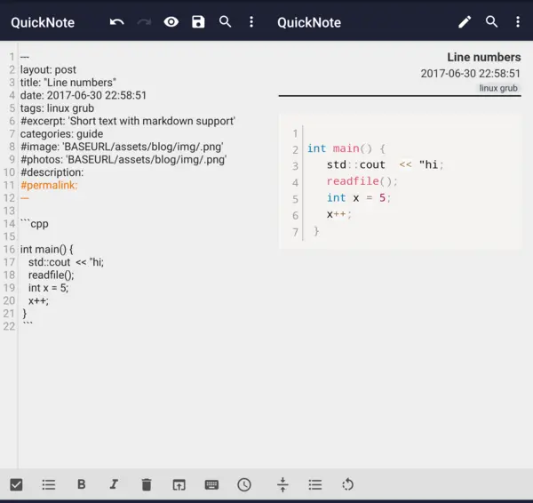

## New format: AsciiDoc
AsciiDoc is one of the new formats that are now supported.
While it might be not as much fleshed out like Markdown, it should fit for general use.

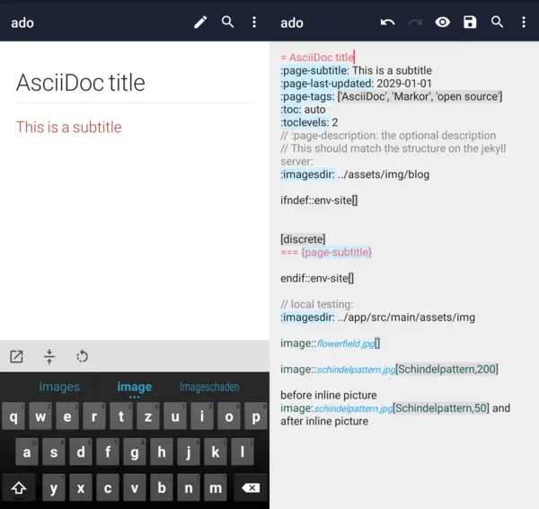

## New format: CSV
[CSV files](https://en.wikipedia.org/wiki/Comma-separated_values) are supported now (in sense of syntax highlighting and preview). 
For details see [CSV README](doc/2023-06-02-csv-readme.md), it was implemented in #1988, #1987, #1980, #1667.

* Editor with SyntaxHighlighter
* Each csv column is shown in a different unique color to see which csv-data belongs to which colum/header
* Preview as html-Table with export as pdf
* A csv column may contain markdown (see column with picture in the screenshot)

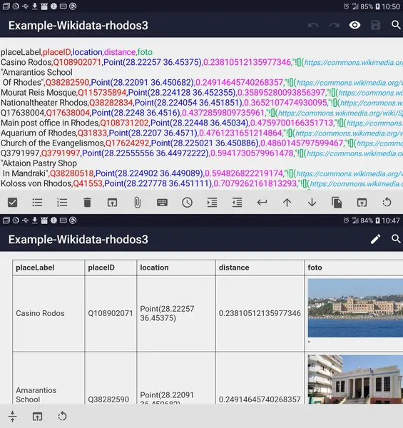

## New format: Org-Mode
The third and last new format newly added is Org-Mode. Note that currently only editor syntax highlighting and action buttons to make editing easier are available.
There is no dedicated view mode implemented.

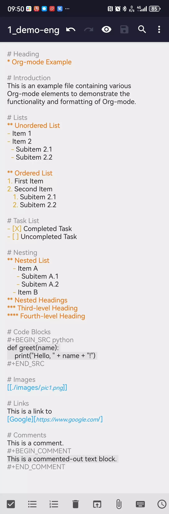

## More

* Architectural improvements:
  * Much simpler permissions (fixes #1981 #1957 #1886 )
  * Better Support for the new storage APIs including scoped storage, SAF (fixes #1172 )
* New Features
  * View mode: open Image,Video,Audio files in Markor ( #1806, #1200 )
  * [Todo.txt advanced search system](https://github.com/gsantner/markor/pull/1901) ( #1901 )
* [More fixed issues:](https://github.com/gsantner/markor/milestone/16?closed=1)

------------------------------------------------------------------------------------------------------------------------------------

# Markor v2.10 - Custom file templates, Share Into automatically remove URL tracking parameters
_16. July 2022_


## Share Into: Automatically remove tracking parameters
Did you know you can share content and URLs into Markor? One of the core features or Markor is **Share Into**, a window specifically for sharing stuff into Markor and quickly appending to existing files (like QuickNote & ToDo), recent opened files or to write into new created files - all from the same place.  

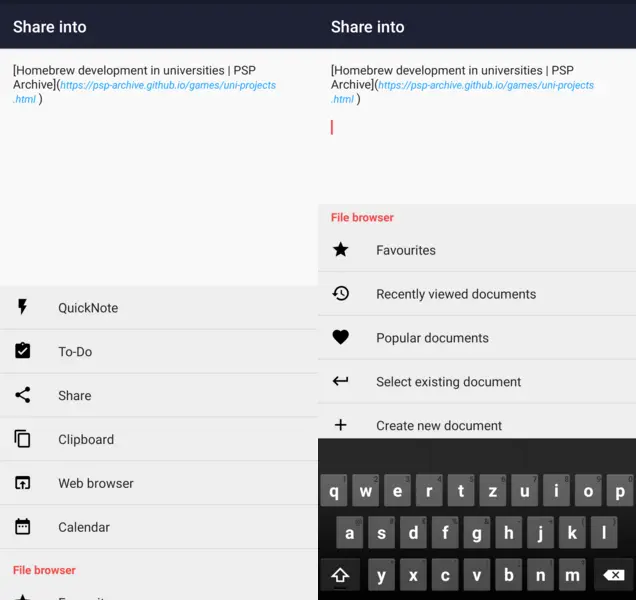

* Beside QuickNote & ToDo you might recall another special file at Markor - LinkBox. One of the main features of Share Into is to share links (from i.e. your web browser) into Markor, to **create bookmarks & link lists**.  
* Text/Title of links and the URL are extracted and automatically formated in Markdown syntax, resulting in fancy clickable links when you view your Markdown documents later. Note that **you can share any text into Markor, it is not limited to links**.
* Often shared text is not the way you want it. You can **edit text prior appending it to your file**. As shown in the screenshot above there is a editor with syntax highlighting. So if you have to add a few words, rewrite & restructure some text prior pasting - go ahead, no problem.
* You can also re-share the text without adding it to any file (i.e. share into Markor, add a few words, share the final text to 5 messenger contacts)
* Sometimes apps only have the option to share a web-accessible link, but none to open it yourself in the browser. In case a URL is in the shared text, Markor also shows the option to open the link in a browser.

**New in Markor 2.10**

Automatically remove tracking & analytics parameters from URLs shared into Markor.  
Usually when you share URLs from articles you will notice that it is multiple lines long, by adding a lot of unwanted tracking & analytics parameters.  
Markor helps you here to clean the URLs prior displaying them - by removing parameters like utm_, ref, fbclid & more.

- [ShareInto: Filter few additional tracking parameters in shared URLs, by @gsantner](https://github.com/gsantner/markor/issues/1490)


## New file dialog: Custom file templates & snippets
(See also: [Markor 2.9 Snippets / custom templates](#snippets--custom-templates))

Create as many custom snippets / templates you like by placing textfiles in the subdirectory `.app/snippets` of your Markor notebook (start) directory.   
Open a document and place the cursor on whatever position you want to insert text.   
Then click the new snippets button on the bottom-bar (see screenshot) and select the desired snippet. 

<small>Note: The snippet directory is automatically created the first time you click the snippets button in the bottom-bar.</small>

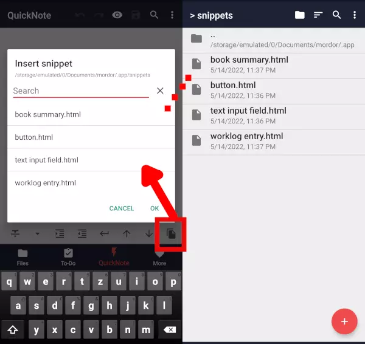


**NEW (Added in Markor 2.10)**

- [New file dialog: Custom file templates, using snippets folder (notebook/.app/snippets), by @gsantner, closes #676](https://github.com/gsantner/markor/issues/676)

Being able to make custom file templates and creating new files of it was a very frequent requested feature.  
Now with this Markor update this feature is available. Using the same system like snippets (as seen above) you can create files out of templates directly in the _new file_ dialog.  

With this improvement the system is even more flexible - based on the same templates you create once, you can 

* create & start editing a complete new file
* insert anywhere right at the cursor while editing a file

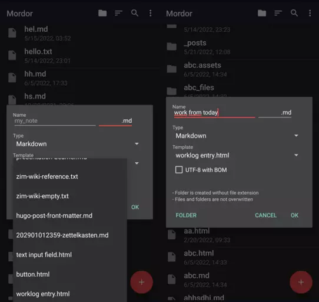


## Dialog improvements
Most dialogs got a few minor improvements. The most important change is that the search dialog keeps now open when you used in-content search. This allows you to jump & browse other search matches without repeating the search.

- [Search: Keep in-files search dialog open, closes #1663, by @harshad1 (PR #1689)](https://github.com/gsantner/markor/pull/1689/files)
- [Dialogs: Don't show OK button at dialogs that require specific selection, by @gsantner closes #1699, closes #1700](https://github.com/gsantner/markor/commit/b4ae32bf0e8ab890ded57718a9598da7a7d52870)
- [Rename dialog: Check file existance case insensitive (Android filesystem usually is insensitive), by @gsantner, closes #1695](https://github.com/gsantner/markor/issues/1695)
- [Improve Dialog OK button constraints #1699, by @harshad1 (PR #1720)](https://github.com/gsantner/markor/pull/1720/files)
- [SearchDialog: Improve condition calculation for simple dialogs, by @harshad1 (PR #1751)](https://github.com/gsantner/markor/pull/1751/files)
- [todo.txt filter search: Disable highlighting at completed tasks, by @harshad1 (PR #1754)](https://github.com/gsantner/markor/pull/1754/files)


## Changes to file browser & file management
- [Sync clients: Remove irritating file paths from unsupported dialog, by @gsantner, closes #1705](https://github.com/gsantner/markor/issues/1699)
- [dotFiles: Hide "*_files" and "*.assets" from browser->save page to html, by @tifish (PR #1704)](https://github.com/gsantner/markor/pull/1704/files)
- [More deterministic save / resume - Switching on every tab move, by @harshad1 (PR #1736)](https://github.com/gsantner/markor/pull/1736/files)
- [Improve file handling (hash calc) & FileInfo detection, by @harshad1 (PR #1719)](https://github.com/gsantner/markor/pull/1719/files)
- [File management: Support UTF-8 with BOM, by @tifish (PR #1693)](https://github.com/gsantner/markor/pull/1693/files)

## Increased performance & under the hood improvements:
Markor got lot's of under the hood improvements in all areas - editor, filebrowser, syntax highlighting, textactions, widgets...

- [Editor: Increase performance on editables, more chunked operations, by @harshad1 (PR #1694)](https://github.com/gsantner/markor/pull/1694/files)
- [Use style/AppTheme.Unified.StartupFlash for DocumentActivity, by @gsantner, closes #1717](https://github.com/gsantner/markor/issues/1717)
- [Various performance improvements, by @harshad1 (PR #1735)](https://github.com/gsantner/markor/pull/1735/files)
- [Editor: Restore behaviour - don't overwrite newer files unless content modified, by @harshad1 (PR #1758)](https://github.com/gsantner/markor/pull/1758/files)
- [Editor: Disable richtext pasting which can lead to dropped characters, by @gsantner, closes #1614](https://github.com/gsantner/markor/issues/1614)
- [Launcher shortcuts: Open ToDo & QuickNote at bottom, by @harshad1 (PR #1748)](https://github.com/gsantner/markor/pull/1748/files)


------------------------------------------------------------------------------------------------------------------------------------

------------------------------------------------------------------------------------------------------------------------------------

------------------------------------------------------------------------------------------------------------------------------------


# Markor v2.9 - Snippets, Templates, Graphs, Charts, Diagrams, YAML front-matter, Chemistry
_14. May 2022_


## Admonition: block-styled side content
The Admonition Extension allows for easy creation of beautiful colored boxes.  
Helpful when you often work with side notes and boxed content.

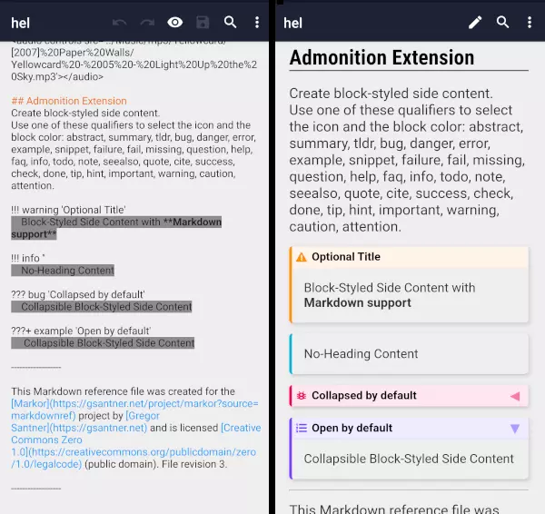


## Snippets / Custom templates
Create as many custom snippets / templates you like by placing textfiles in the subdirectory `.app/snippets` of your Markor notebook (start) directory.   
Open a document and place the cursor on whatever position you want to insert text.   
Then click the new snippets button on the bottom-bar (see screenshot) and select the desired snippet. 


<small>Note: The snippet directory is automatically created the first time you click the snippets button in the bottom-bar.</small>


## Display YAML front-matter block contents
Markor now parses the Markdown YAML front-matter and can display it's contents in the view mode.  
The keys to display can be configured in the Markdown settings category.


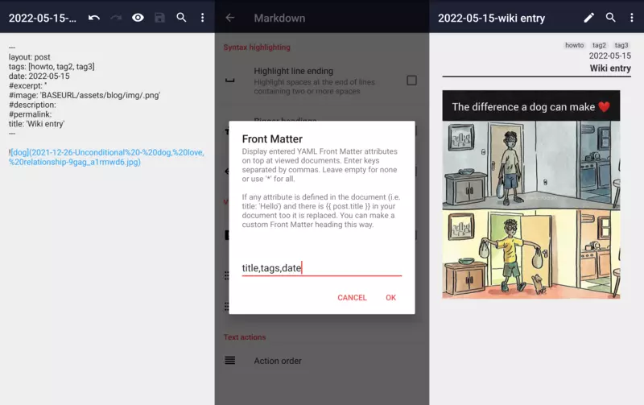

## Increased performance & under the hood improvements
Markor got lot's of under the hood improvements in all areas - editor, filebrowser, syntax highlighting, textactions, widgets...

Notable:
* Faster screen transitions
* Short-time filesystem metadata caching for quicker loading of folders at the filebrowser


## Charts / Graphs / Diagrams (mermaidjs)
You can now create graphs using mermaidjs syntax in Markdown files.  
Checkout the [mermaidjs live-editor](https://mermaid-js.github.io/mermaid-live-editor) for more & advanced examples.

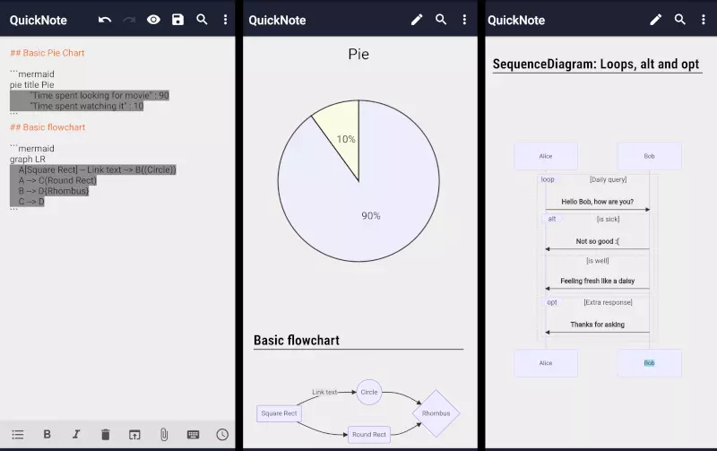


## Other notable changes & additions
- Allow to install APK files from filebrowser on click
- Markdown Table of Contents options
- Zim: Follow links to other wiki pages
- todo.txt: Better browsing at editor with dialog & saved search queries
- Settings option to enable/disable Chrome Custom Tabs
- Privacy settings option to disallow screenshots of Markor
- Debloat & drop experimental/unused features, i.e. todo.txt huuid
- Support Android Day/Night theme system
- Filebrowser: Show full filename (multiline allowed instead of singleline only)
- View mode: Open links to folders in filebrowser
- Markdown: Better Math support, add mhchem chemistry module
- Per-file settings - In addition to the global settings, many options are now also configurable on a file basis

### More changes
* [Add Markor blog posts markdown documents, by @gsantner](https://github.com/gsantner/markor/commit/ddb41a6e)
* [Renumber list performance improvement, by @harshad1 (PR #1688)](https://github.com/gsantner/markor/commit/0142c2e1)
* [Fix: Template is not applied when creating new file, by @tifish (PR #1669)](https://github.com/gsantner/markor/commit/7616818b)
* [Enable filename text input filter at rename dialog, by @gsantner closes #1668](https://github.com/gsantner/markor/commit/2102dc6e)
* [Cleaner widget logic, update widget on path change, by @harshad1 (PR #1660)](https://github.com/gsantner/markor/commit/79bcb47a)
* [Take picture: Change filename template to usual camera format, by @gsantner, #1655](https://github.com/gsantner/markor/commit/7146fb62)
* [Improve showing selection and related functions, by @harshad1 (PR #1658)](https://github.com/gsantner/markor/commit/0db38d5c)
* [Improvements to show selection after search / heading etc, by @harshad1, closes #1325 (PR #1653)](https://github.com/gsantner/markor/commit/efb9f6a1)
* [Replace discussion reference from Matrix to GitHub discussions, by @gsantner](https://github.com/gsantner/markor/commit/3514491d)
* [Filebrowser: Fix copy/move getCurrentFolder() NullPointer, by @gsantner](https://github.com/gsantner/markor/commit/7a3ffd04)
* [Fix ArrayIndexOutOfBounds at ShortcutUtils, by @gsantner](https://github.com/gsantner/markor/commit/e746478c)
* [Filemanager: disable search button at root directory, closes #1652, by @gsantner](https://github.com/gsantner/markor/commit/47de5795)
* [Base functionality to handle Toolbar (title) clicks & long-clicks, by @gsantner](https://github.com/gsantner/markor/commit/6ac968c5)
* [Simplify TextAction handling code, by @harshad1 (PR #1626)](https://github.com/gsantner/markor/commit/f2aa4b59)
* [markdown: Fix rendered list indent with depth 3, closes #1643, by @fgtham (PR #1651)](https://github.com/gsantner/markor/commit/302b022f)
* [Don't run auto-format immediately on document load, by @gsantner](https://github.com/gsantner/markor/commit/6014327f)
* [Fix version of AppIntro dependency, by @gsantner, closes #1632](https://github.com/gsantner/markor/commit/285551f2)
* [Feature: Snippets, by @harshad1, closes #437 (PR #1624)](https://github.com/gsantner/markor/commit/3f7243b0)
* [Automatically set HTML lang attribute, by @fgtham (PR #1623)](https://github.com/gsantner/markor/commit/cd3d0fec)
* [TextActions improvements for spacing and save, by @harshad1 (PR #1622)](https://github.com/gsantner/markor/commit/86a55620)
* [textactions: allow setting lower spacing, by @harshad1 (PR #1621)](https://github.com/gsantner/markor/commit/c7fdadde)
* [wording improvements](https://github.com/gsantner/markor/commit/b46291f8)
* [Markdown: Fix wrong indentation of code blocks in checklists, by @fgtham, closes #1600 (PR #1620)](https://github.com/gsantner/markor/commit/98e9e83e)
* [markdown: YAML front-matter improvements, by @gsantner (PR #1597)](https://github.com/gsantner/markor/commit/8fb99feb)
* [rename string sort 'Sort by' -> sort_by, by @gsantner](https://github.com/gsantner/markor/commit/d69e1abf)
* [markdown: Support and display YAML front-matter block contents, by @fgtham @gsantner (PR #1597)](https://github.com/gsantner/markor/commit/dac68bf4)
* [Reformat code, optimize imports](https://github.com/gsantner/markor/commit/d9c78be2)
* [todo.txt: Insert new task start date generally if Auto-Format is enabled, remove special settings option, by @gsantner, closes #1592](https://github.com/gsantner/markor/commit/0b48c2a5)
* [Per-file toggle for auto-format, by @harshad1, closes #1592 (PR #1611)](https://github.com/gsantner/markor/commit/1a1bdb5b)
* [markdown: Add admonition extension, by @fgtham @gsantner (PR #1584)](https://github.com/gsantner/markor/commit/a162bd8b)
* [Markdown: Improve/Fix KaTeX math expression integration, closes #1389, closes #1393, by @fgtham @gsantner (PR #1576)](https://github.com/gsantner/markor/commit/5ac79f9f)
* [ISSUE_TEMPLATE: improve template](https://github.com/gsantner/markor/commit/757efd40)
* [Markdown toc: Frontmatter may be followed by optional empty line, by @fgtham, closes #1246 (PR #1589)](https://github.com/gsantner/markor/commit/86742ebc)
* [ISSUE_TEMPLATE: Add dropdown selection for format](https://github.com/gsantner/markor/commit/c539ae7d)
* [Update ISSUE_TEMPLATE](https://github.com/gsantner/markor/commit/74c7bb83)
* [Remove EXTRA_PATH_IS_FOLDER intent parameter everywhere, by @harshad1 (PR #1582)](https://github.com/gsantner/markor/commit/f404ed14)
* [Improve document handling, by @harshad1 (PR #1579)](https://github.com/gsantner/markor/commit/53f87404)
* [markdown: Support flowcharts with mermaid, by @fgtham, closes #720 (PR #1581)](https://github.com/gsantner/markor/commit/0812c174)
* [markdown math/katex: support mhchem (chemistry), by @fgtham (PR #1575)](https://github.com/gsantner/markor/commit/7b84c407)
* [Fix multiple windows not working in v2.8.5, by @harshad1, closes #1570 (PR #1572)](https://github.com/gsantner/markor/commit/18fa6c64)
* ---------
* [Markor v2.8.6 update](https://github.com/gsantner/markor/commit/79317e33)
* [more: Add buildinfo field for last git commit message, by @gsantner](https://github.com/gsantner/markor/commit/01ccc836)
* [readme: Improve structure and add more information](https://github.com/gsantner/markor/commit/ff7b1356)
* [readme: Remove codacy github badge](https://github.com/gsantner/markor/commit/371cb8cd)
* [preview: Open links to folders in filebrowser, closes #967, by @gsantner](https://github.com/gsantner/markor/commit/ba446f48)
* [ShareInto: Strip common tracking parameters, by @gsantner, closes #1490](https://github.com/gsantner/markor/commit/2b5d05c3)
* [Editor: Fix crash at activity state restoring, closes #1565, by @gsantner](https://github.com/gsantner/markor/commit/d4d8f410)
* [ShareInto: Fix newline append issue, closes #1569, by @gsantner](https://github.com/gsantner/markor/commit/440189b0)
* [Replace Google Play badge](https://github.com/gsantner/markor/commit/3573e63d)
* ---------
* [Markor v2.8.5 update release](https://github.com/gsantner/markor/commit/cd25950c)
* [Zim: Fix Android SDK API level error, by @gsantner](https://github.com/gsantner/markor/commit/046d0d31)
* [Theming: Startup & Activity animations: Quicker, less flashing, closes #1517 #568, by @gsantner](https://github.com/gsantner/markor/commit/c87752a0)
* [Filebrowser: Allow shown filename multiline expansion, by @gsantner, discussions #1557 #1558 #1559](https://github.com/gsantner/markor/commit/02cd0c36)
* [Reformat XML files, by @gsantner](https://github.com/gsantner/markor/commit/5a5ce82e)
* [Support day/night theme system, by @harshad1 @gsantner (PR #1543)](https://github.com/gsantner/markor/commit/9cbe72b0)
* [Update year 2021->2022](https://github.com/gsantner/markor/commit/9fdc5a1f)
* [Debloat: Drop todo.txt huuid experiment, by @gsantner](https://github.com/gsantner/markor/commit/f7c81393)
* [Debloat: Drop redundant launcher shortcut option from editor (new->filebrowser), by @gsantner](https://github.com/gsantner/markor/commit/1dd1cc63)
* [Reformat code, by @gsantner](https://github.com/gsantner/markor/commit/2e0b788a)
* [Add launcher shortcuts to folders, by @harshad1 (PR #1549)](https://github.com/gsantner/markor/commit/0c27e81c)
* [Set MIN_OVERWRITE_LENGTH=2](https://github.com/gsantner/markor/commit/c43bd37f)
* [filebrowser: Change notebook folder menu icon to home, by @harshad1 (PR #1535)](https://github.com/gsantner/markor/commit/456100c2)
* [Bugfix: TextActions document can be null, by @harshad1 (PR #1544)](https://github.com/gsantner/markor/commit/e02cd233)
* [Document menu: Swap search<->save button position, by @gsantner](https://github.com/gsantner/markor/commit/acb073aa)
* [Directly show view mode in mainactivity (ToDo, QuickNote), by @gsantner](https://github.com/gsantner/markor/commit/c6a4fbe4)
* [Markdown: soft wrap lines with link, by @gsantner, closes #1536](https://github.com/gsantner/markor/commit/190410b6)
* [File change state indication & general improvements, by @harshad1 @gsantner (PR #1516)](https://github.com/gsantner/markor/commit/ca6f4908)
* [Privacy: Add option to disallow screenshots, closes #1174  (PR #1514 by @Zoo-M0 @gsantner)](https://github.com/gsantner/markor/commit/c6af143d)
* [ShareInto: Only trim line breaks when appending, by @gsantner, closes #1526](https://github.com/gsantner/markor/commit/30ca7997)
* [Combined storage permission check, restart mainactivity & reload all files after grant, by @gsantner (premerge #1359 #1521)](https://github.com/gsantner/markor/commit/dc9453c0)
* [Add view mode debugging hint. by @gsantner](https://github.com/gsantner/markor/commit/5b2e12f7)
* [Update gradle-wrapper, export activites, by @gsantner (premerge #1359 #1521)](https://github.com/gsantner/markor/commit/4b228db2)
* ---------
* [Markor update v2.8.4](https://github.com/gsantner/markor/commit/f03ac72a)
* [Rename markor baseactivity and use everywhere, move OpenEditor activity to subdir, by @gsantner](https://github.com/gsantner/markor/commit/9a8673af)
* [Reformat code, by @gsantner](https://github.com/gsantner/markor/commit/5d1ce8a6)
* [Markdown: Support spaces in markdown links and images, closes #1365 (PR #1510), by @tifish @gsantner](https://github.com/gsantner/markor/commit/4195eeff)
* [ShareInto: Fix todo.txt entry won't appear, by @gsantner, PR #1495](https://github.com/gsantner/markor/commit/06012927)
* [Add option to control Chrome Custom Tab behaviour, by @gsantner, closes #686 #1385](https://github.com/gsantner/markor/commit/19a06a47)
* [todo.txt: Add option to save search queries, by @harshad1 (PR #1467)](https://github.com/gsantner/markor/commit/31d4dbeb)
* [Remove NO_SUGGESTIONS hint from a few dialogs, by @gsantner, closes #1507 #1508](https://github.com/gsantner/markor/commit/5f934962)
* [Delay inputfilter addition at document load](https://github.com/gsantner/markor/commit/382441c7)
* [Private AppStorage: Allow to access to files directory only (don't allow access to internals like shared_preferences & databases)](https://github.com/gsantner/markor/commit/2f550012)
* [Share Into - Format](https://github.com/gsantner/markor/commit/a25e9522)
* [MainActivity todo/quicknote scroll to bottom via setUserVisibleHint](https://github.com/gsantner/markor/commit/7f3c4bfd)
* [Remove one setDocumentViewVisibility call, #1502](https://github.com/gsantner/markor/commit/d3e91a8a)
* [ShareInto format/prefix: Improve wording, restore previous defaultvalue](https://github.com/gsantner/markor/commit/687ef527)
* [Share into format/prefix customization, by @harshad1, closes #1368 (PR #1495)](https://github.com/gsantner/markor/commit/23f79cf0)
* [Optimize imports & autoformat](https://github.com/gsantner/markor/commit/93129cbe)
* [Improve file I/O, by @harshad1 (PR #1489)](https://github.com/gsantner/markor/commit/06ad871d)
* [Move bundled fonts to thirdparty directory, drop 3 fonts to reduce apk size](https://github.com/gsantner/markor/commit/7dc3b05c)
* [CI/CD: Makefile: Configurable flavor](https://github.com/gsantner/markor/commit/2492adc6)
* [CI/CD: Makefile: Add app run job](https://github.com/gsantner/markor/commit/38e8c04a)
* ---------
* [Markor v2.8.3](https://github.com/gsantner/markor/commit/adce9627)
* [Add spellchecking capabilities for strings.xml to Makefile & CI/CD, by @gsantner](https://github.com/gsantner/markor/commit/ac08c4f7)
* [filemanager: Always load latest fav/recent/popular files when browsing to it](https://github.com/gsantner/markor/commit/d02b9a0d)
* [ShareInto:: reset modTime after writing, so it's correctly reloaded at time of opening at editor, by @gsantner](https://github.com/gsantner/markor/commit/3d9540e7)
* [filebrowser::rename file::fix/workaround for Android's filesystem case-insensitive filenaming, by @gsantner, closes #1481](https://github.com/gsantner/markor/commit/7541863d)
* [Debug builds (aaTest): Properly show version of Markor at 'More' page](https://github.com/gsantner/markor/commit/285d0367)
* ---------
* [Markor v2.8.2](https://github.com/gsantner/markor/commit/95d45315)
* [Improve file open/close speed, fix file read/write issues, closes #1470, by @harshad1 @gsantner (PR #1473)](https://github.com/gsantner/markor/commit/07c584e0)
* [Zim: follow links to other wiki pages, closes #1223, by @fredericjacob (PR #1437)](https://github.com/gsantner/markor/commit/520dee63)
* ---------
* [Release update v2.8.1, by @gsantner](https://github.com/gsantner/markor/commit/a2c4d1f4)
* [Workaround for buggy keyboard at file/folder creation, fixes #1461 (PR #1466 by @gsantner)](https://github.com/gsantner/markor/commit/39220039)
* [Remove unused class AppCast](https://github.com/gsantner/markor/commit/b0d95b6a)
* [Fix preference-key based buttons in turkish locale, fixes #1425 # 1443 (PR #1455 @gsantner)](https://github.com/gsantner/markor/commit/bbb0c588)
* [Fix recently added languages not displayed accordingly (#1454 by @gsantner)](https://github.com/gsantner/markor/commit/c9ffc349)
* [Fix language preference: Properly show all languages (PR #1453 by @gsantner)](https://github.com/gsantner/markor/commit/7ff1f138)
* [Add language Odia/Oriya (India), Update translations (PR #1446 #1451)](https://github.com/gsantner/markor/commit/b5513b0d)
* [ZimWiki: Syntax highlighting for code, global setting (PR #1434 by @fredericjacob)](https://github.com/gsantner/markor/commit/3bc417c3)
* [Markdown: Individual table of contents level options (PR #1427 by @fredericjacob @gsantner)](https://github.com/gsantner/markor/commit/2005fa48)
* [Update crowdin config](https://github.com/gsantner/markor/commit/129f07e0)
* [Translation update (PR #1429)](https://github.com/gsantner/markor/commit/62f21259)
* [filebrowser: Improve performance a lot (speed of file list appearing)](https://github.com/gsantner/markor/commit/83a4e2f7)
* [filebrowser:sort: use compareToIgnoreCase for name comparision](https://github.com/gsantner/markor/commit/aa5b5439)
* [Browse todo.txt file by various filters (PR #1408 by @harshad1)](https://github.com/gsantner/markor/commit/7e680df2)
* [todotxt: Save priority on done by pri:X kv (PR #1420 by @harshad1)](https://github.com/gsantner/markor/commit/a4719b7a)
* [Allow to install APK files from filebrowser on click, by @gsantner (PR #1417)](https://github.com/gsantner/markor/commit/3d5fc9c2)
* [Automatically find FileProvider, by @gsantner](https://github.com/gsantner/markor/commit/f101beda)
* [ShareUtils:: mark fileProviderAuthority static](https://github.com/gsantner/markor/commit/fc9269b6)


------------------------------------------------------------------------------------------------------------------------------------

------------------------------------------------------------------------------------------------------------------------------------

------------------------------------------------------------------------------------------------------------------------------------


# Markor v2.8 - Multi-selection for todo.txt dialogs
_29. July 2021_


## Multi-selection for todo.txt dialogs
Multi-selection was added to Markor's dialogs, particularly for the todo.txt format.

* You can now select multiple context & formats to search for, or to insert.

* The search button (top menu) will also show the multi-selection when you have a file in todo.txt format open.
If you select multiple todos and they are not one after the other, then those entries are reorder. 
Afterwards all selected entries will be highlighted in the editor, and you may apply actions on them. Like mark all of them as done or add one or more contexts.

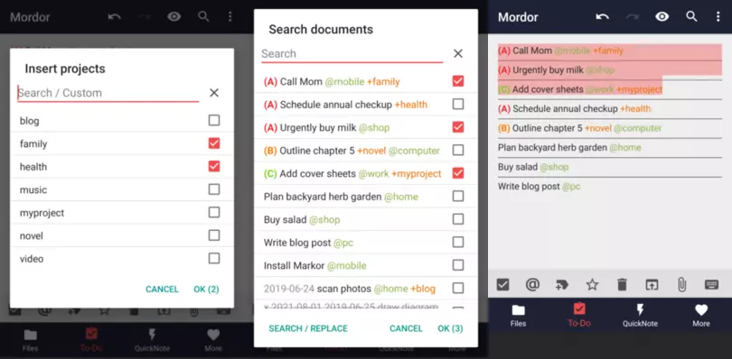

## More changes
- Reference to GitHub discussion on More page, by @gsantner
- Add multi-selection to todo.txt dialogs, by @harshad1 @gsantner
- In-content search support for encrypted files, #1388 by @opensource21
- Remove alternative todo.txt naming (tags/categories), by @gsantner


------------------------------------------------------------------------------------------------------------------------------------

------------------------------------------------------------------------------------------------------------------------------------

------------------------------------------------------------------------------------------------------------------------------------


# Markor v2.7 - Search in content, Backup & Restore settings
_26. June 2021_


## Search files by content
You can recursive search for files by their contents now. The search button remains at it's place at the file managers top menu.  
The popup dialog has new options to configure search in content or only by filename, case sensitivity and if the search in content should use the input as regex.

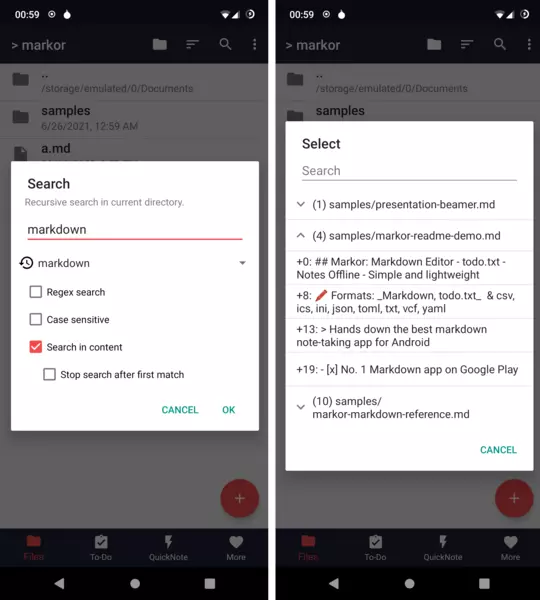


## Backup & Restore settings
You can backup & restore Markor's settings now, there is a new option in the settings for each.  
The backup is a json text file.

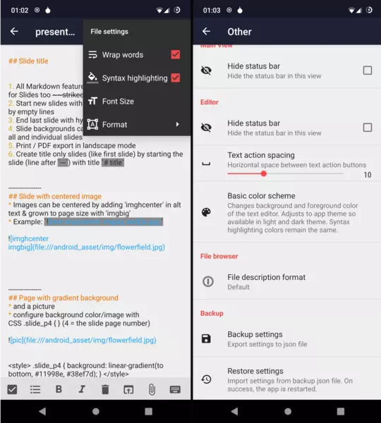


## Per-file settings: Font size
Per-file settings were introduced in the [Markor v2.5 update](#per-file-settings).

With this update, file size is now also controllable & saved per file via the editor's top menu.  
The standard/default configuration is still available in the global settings (used if you did not pick a custom font size for the current file).

## File Manager: Conflict handling for existing files
With this update, Markor will ask you what should be done when you are about to move/copy a file but a file of same name already exists.  
You can decide to skip (keep old target file) or overwrite with the new file, or keep both.

When you copy/move multiple files, you get the option to apply the decision (skip/overwrite/keep) to all files or only the file shown in dialog.

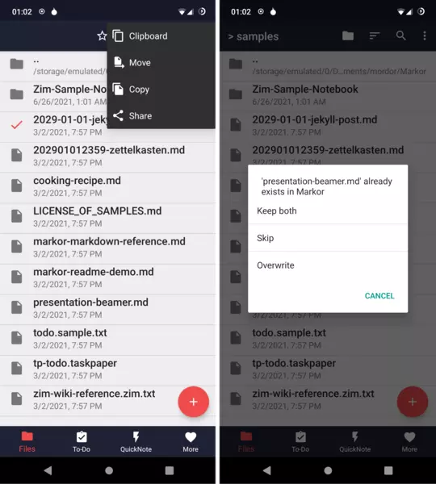


## More Changes
- Recursive file search with in-content search, #1337 by @adelobosko @harshad1 @gsantner
- Backup and restore settings, Format selection with radio buttons, #1244 by @harshad1 @gsantner
- Per-file font size, #1332 by @harshad1
- Markdown: Support superscript^2^ syntax, #1268 by @gsantner
- View mode: Image/PDF export whole page, add seperate screenshot option, by @gsantner
- todo.txt: Fix trailing space resulting in contexts/projects/due-dates to be entered twice, #1282 by @harshad1
- Markdown: Enable GitLab extension, display video links as html5-video, #1280 by @gsantner
- Markdown: Enable typographic transformation, #1277 by @gsantner
- todo.txt: Fix tags dialog not shows up onLongClick, #1292 by @gsantner
- Editor: Allow top-menu back button also when the file is empty, #1290 by @harshad1
- ShareInto: Improve automatic link reformatting, #1275 by @harshad1
- Search dialogs: Hide search input field when if there is no data, #1298 by @harshad1
- Decrease scrollbar width for better usability, #1306 by @harshad1
- todo.txt: Settings option for always-visible @contexts & +projects, #1305 by @harshad1 @gsantner
- TextActions: Improve cursor placement at Regex replace, #1310 by @harshad1
- File manager: Move/Copy file improvements, add Yes/No/All overwrite options, #1281 by @harshad1
- Fix App might crash on toolbar-click for TOC, #1336 by @adelobosko
- Fix Android 4.4 crash on file move/copy, #1333 by @harshad1
- Fix Android 4.4 crash when opening .txt file due to ZimWiki format detection, #1341 by @fredericjacob
- Markdown: Don't match extra spaces at ordered-list regex, #1367 by @harshad1
- File Manager: Fix MB being displayed as GB at description (SI 1000 unit), #1352 by @gsantner
- File Manager: Duplicate file / allow copy into same folder, #1345 by @harshad1- Filemanager formatter: fix MB being displayed as GB (SI 1000 unit), #1352 by @gsantner


------------------------------------------------------------------------------------------------------------------------------------

------------------------------------------------------------------------------------------------------------------------------------

------------------------------------------------------------------------------------------------------------------------------------


# Markor v2.6 - Zim Wiki, Newline = New Paragraph, Save Format
_28. February 2021_


## Zim Wiki improved
Zim Wiki was introduced in the [previous update Markor v2.5](#new-format-zim-wiki).  
This update includes many quality improvements and additions for Zim Wiki:

- Editor: Support Table of contents (top menu)
- Simplify Zim format detection
- Add more text actions (links, images, checkbox, ..)
- Support file generation on older Android versions

If you don't know how the Zim format & syntax works, Markor also includes a reference template  
that gives you an overview. It is available from the `+ (New file)` dialog in the app or from [GitHub](https://github.com/gsantner/markor/tree/master/samples).

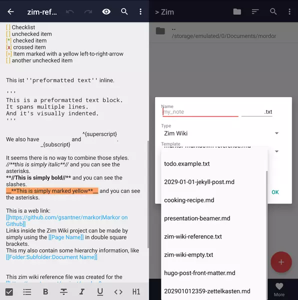

## Newline = new paragraph

By Markdown (more precise - CommonMark) specification, new lines only start a new paragraph when you end the line with two spaces  (in the View Mode & exports).
You might prefer to always start new lines. For this case there is a new settings option - with it enabled new lines also start a new paragraph.

You can enable this opt-in settings option in the Markdown section.

## Per-file settings: Remember selected Format
Per-file settings were introduced in the [previous update Markor v2.5](#per-file-settings).  

With this update, Format selection has been reworked. The selected Format is now remembered and restored for each file 
and was moved to the _File settings_ submenu at the top menu. The current selected Format is now highlighted.


### More changes
- Markdown: Add settings option for newlines to start new paragraphs, #1260 by @gsantner
- Editor/Viewer: Remember last used file format, show current selected format, #1226 by @harshad1
- Editor/Viewer: Back arrow (top menu) finish activity, #1165 by @gsantner
- Editor: Per-file option to enable/disable syntax highlighting, #1168 by @harshad1
- Share-Into: Add launcher, #1184 by @gsantner
- Markdown: Apply Markor Table of Content config for custom `[TOC]: #` too, #1189 by @gsantner
- Editor: Improve writing to sdcard, #1192 by @gsantner
- Zim: Support file generation on older Android versions, #1194 by @gsantner
- Zim: Editor: Support Table of contents (top menu), #1186 by @fredericjacob
- Markdown: Math/KaTex: Improve \\ line breaks usage, #1196 by @radanovicnik
- ShareInto: Add space after formatted link - messengers then show correct link preview, by @gsantner
- Markdown: Add break page example to Markdown reference, by @gsantner
- Editor: Prevent Android accessibility & autofill to produce errors, #1204 by @harshad1
- Main page: Reduce friction when app was running in background for a while, #1210 by @harshad1
- Search: Add input field to filter search results, #1222 by @harshad1
- Markdown: Don't start new list item when reaching file end and toggling, #1213 by @harshad1
- Zim: Simplify Zim format detection, #1227 by @gsantner
- Zim: Add more text actions (links, images, checkbox, ..), #1195 by @fredericjacob
- All formats: Date/Time dialog don't add entry twice to history, #1229 by @harshad1
- Editor/Viewer: Increase scrollbar width, #1241 by @harshad1
- File browser: File move start from current folder, #1234 by @harshad1
- Editor/Viwer: Add file info option (document top menu), #1233 by @harshad1
- Viewer: Privacy: Opt-out of Android WebView's internal metrics, #1181 by @gsantner
- Markdown: Support Notable's special home brewed syntax for attachments, #1252 by @gsantner
- Dependencies: Add source code of colorpicker and build subproject, by @gsantner
- Optimize image assets, by @gsantner
- DevOps: Improvements to GitHub Actions CI/CD configuration, by @gsantner
- Improve encryption wording & usage, #1171 #1179 by @opensource21


------------------------------------------------------------------------------------------------------------------------------------

------------------------------------------------------------------------------------------------------------------------------------

------------------------------------------------------------------------------------------------------------------------------------


# Markor v2.5 - Zim Wiki - Search & Replace - Zettelkasten
_20. December 2020_


## New format: Zim Wiki
The Markor community has been asking for Zim & Wiki Text support a long time, now it is available at Markor.
It is implemented at full glance including syntax highlighting (edit mode), text actions & converter (view mode).

If you don't know how the Zim format & syntax works, Markor also includes a reference template  
that gives you an overview. It is available from the `+ (New file)` dialog in the app or from [GitHub](https://github.com/gsantner/markor/tree/master/samples).

### How does it look like?

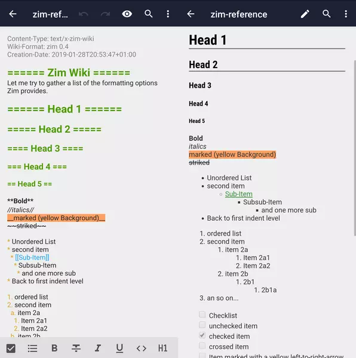


### What is available?
Most features that the Zim syntax offers are available from the beginning for everything at Markor.  
So beside Markdown you can now also use Zim for taking notes, keeping journals, organize your tasks and more.


|  Category    | Actions, Highlighting, View                                                                                                               |
|--------------|-------------------------------------------------------------------------------------------------------------------------------------------|
| List         | Ordered (1./a.), Unordered (* ), Tasks/Checkboxes (☑️)                                                                                   |
| Text Style   | **Bold**, *Italic*, <u>Underline</u>, ~~Striketrough~~, <sup>Superscript</sup>, <sub>Subscript</sub>                                     |
| Color        | <mark>Marked (Highlighted)</mark>, <span style='color: #ff8b46;'>Foreground</span>, <span style='background: #00ff00;'>Background</span>  |
| Special      | Headings 1-5, `Code (inline & block)`                                                                                                   |
| References   | [Web links](https://github.com/gsantner/markor/pull/1098), Files & Wiki entries, Images                                             |

**Notice:** This is the first version of Markor with Zim support. Improvements, potentials fixes & more features to come!


### What is Zim?
> Zim is a graphical text editor used to maintain a collection of wiki pages. 
> Each page can contain links to other pages, simple formatting and images.
> Pages are stored in a folder structure, like in an outliner, and can have attachments.
> Creating a new page is as easy as linking to a nonexistent page. All data is stored in plain text files with wiki formatting.
>
> 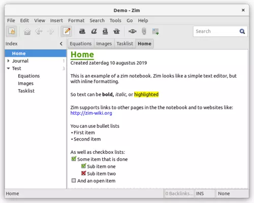
>
> Zim can be used to:
> * Keep an archive of notes
> * Keep a daily or weekly journal
> * Take notes during meetings or lectures
> * Organize task lists
> * Draft blog entries and emails
> * Do brainstorming
>
> Zim handles several types of markup, like headings, bullet lists and of course bold, italic and highlighted.
> This markup is saved as wiki text so you can easily edit it with other editors.
>
> **Source:** [zim-wiki.org](https://web.archive.org/web/20201219192408/https://zim-wiki.org/), December 2020 


## Search & Replace - Simple or Regex
Text replace functionality was added to Markor - for both simple and advanced use cases.  

* You can do **simple text replacement**s ( `text a` -> `text b` )
* You can do **Regex replacement**s ( `.*http.*` -> `Link removed`)
* You can do **Replace (1)** (next occurrence from current cursor position)
* You can **Replace all** (all occurrences in the current file)
* You can **view the amount of matches** - count specific words, characters & more (optionally with regex)

### How to replace?
1. Open a file & use the Search button in the toolbar (🔍) 
2. Open the Replace popup via _Search / Replace_
3. Enter search text & the replacement, check regex/multiline as needed
4. Use Replace (1) or all to execute the replacement

### How does it look like?

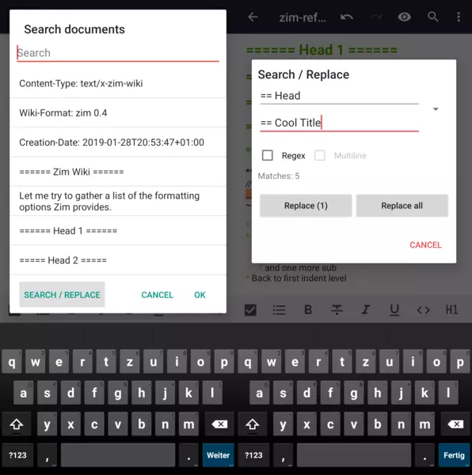

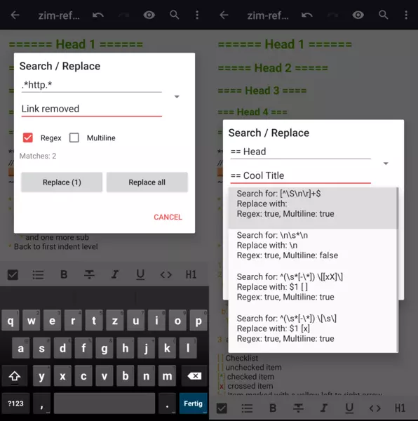


## Tooling changes

### Android SDK & supported devices
Markor is now built with Android SDK 29, minimum required by Google Play.  
Markors minimum supported Android version remains unchanged - „Android Jelly Bean 4.1 (API16)“.

### Continuous Integration & Delivery
The project switched to GitHub Actions for CI/CD as it integrates best with GitHub & there are no relevant restrictions for Open Source projects currently.  

#### Benefits for users
The switch not only comes with benefits for developers, but also users.  
Download & install development builds of Markor from the GitHub Actions artifacts now.  
You can install the test app (Marder) beside Markor.

This means you can see in-development features & try them before any update is released.  
Not only builds of merged changes are available for download, but also from upcoming changes of <i>not-yet-</i>merged pull requests.  
[Open a build to download apk, build & test logs, apk info & more.](https://github.com/gsantner/markor/actions).  

## Per file settings
Some file specific options were added to the editor toolbar menu.  
The global settings are still used as long you don't toggle/change any setting in a file.

You can find the File-Settings in the top toolbar, given you have a file open.  

It currently includes:

* File format (Plaintext / Key-Value / Markdown / todo.txt / Zim Wiki)
* Enable/Disable line wrapping
* Enable/Disable syntax highlighting

## New color schemes & templates
* Nord editor color scheme was added
* Zim Wiki related templates/samples were added
* Zettelkasten template/sample was added


## Project community
Markor gets a lot of new features, improvements and fixes with every update.  
Shout out to [Harshad Srinivasan](https://github.com/harshad1), [Frederic Jacob](https://github.com/fredericjacob), [Peter Schwede](https://github.com/pschwede), [Gregor Santner](https://github.com/gsantner). Thank you very much!


### More Changes
- Add Zim Wiki format and template #1098
- Add search & replace (simple\|regex, replace once\|all) #1112
- Add settings for current file to toolbar #1129
- Fix file sometimes not opens from launcher shortcut #1139
- Use GitHub Actions for CI/CD #1151
- Add template for Zettelkasten #1156
- Add Nord editor color scheme #1134
- Allow to select folder when create new file via share into Markor #1138
- Improve license dialog readability #1119
- General improvements, fixes and translations


------------------------------------------------------------------------------------------------------------------------------------

------------------------------------------------------------------------------------------------------------------------------------

------------------------------------------------------------------------------------------------------------------------------------


# Markor v2.4 - All new todo.txt - Programming language syntax highlighting
_30. October 2020_


## View-Mode syntax highlighting for more languages
Syntax highlighing has been added for many additional (programming) languages in the Markdown view-mode (code block like \`\`\`kotlin):

Elixir, Haskell, Kotlin, Perl, R, Ruby, Scala, Swift


## New todo.txt implementation
todo.txt syntax highlighting is now faster than ever before. 
Also all todo.txt specific text actions have been improved for better compatibility.  
Vaious new features, actions and options also come with the update, checkout the full changelog.

### More changes
- Markdown: Correctly insert or remove list item on press enter at empty list item
- Remove title from todo.txt date dialog, better usable on small devices
- Fix search sometimes not working when chaging from view to edit mode
- Rework Indent & Move lines Actions
- Add settings option to control todo.txt completition date auto insert
- All new todo.txt support in Markor
- Add many languages to view-mode code highlighting
- Add xlf format (plaintext)
- Remove colored highlighting from changelog dialog
- Add search to Markdown edit-mode outline/TOC dialog
- New file dialog remember type selection
- Better preserve current open folder across device rotation & reboot
- todo.txt: Long press sort to sort by most recent used method
- Markdown: Improve bold/italic syntax highlighting with punctuations
- todo.txt: Create done file again when not exists
- Add Actions: Move line up & down, start new line
- Insert Date/Time text action: List of recent time formats
- Control visibility of text actions
- Edit-Mode Search: Open selected position instead of first match
- File browser: Add settings option to customize file description format
- todo.txt: Syntax highlighting in edit-mode search dialog
- Save last used folder to settings, use info for titlebar
- New File Dialog: Remember type selection


------------------------------------------------------------------------------------------------------------------------------------

------------------------------------------------------------------------------------------------------------------------------------

------------------------------------------------------------------------------------------------------------------------------------


# Markor v2.3 - Table of Contents, Custom Action Order
_25. July 2020_


### Markdown: Table of Contents in Edit Mode
Table of contents were already supported at Markdown view mode since quite some time (optional setting).  
A similar functionality is now available for Markdown Edit Mode too.  
Tap the filename at the toolbar to open the Outline (see screenshot below).  
You get a quick overview what the document contains, and it's the fastest way to jump to a specific sections of your text & make edits. 

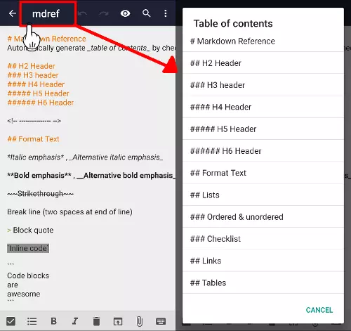

### Editor: Custom action button order
Frequently requested: To be able to order the action buttons for text editing in a order that fits own workflow.  
You can now order all actions as you wish and separately per format (Markdown, todo.txt, Plaintext).  
To change the order open the settings, select the format to customize and in the "Action Order" menu you are able to freely move options.

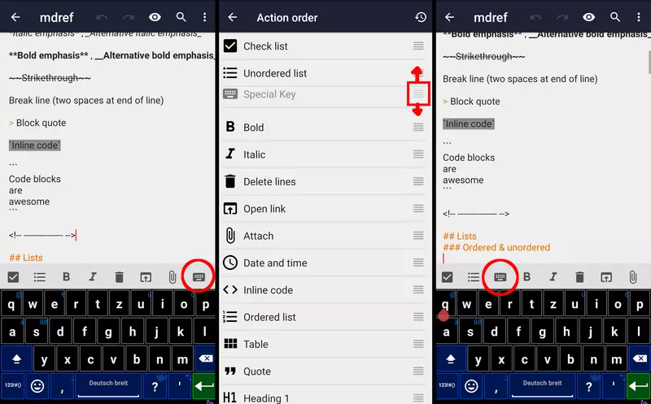

### Project community
Markor gets a lot of new features, improvements and fixes with every update.  
This time especially due [Harshad Srinivasan](https://github.com/harshad1)s precious time. Thank you very much!  

### More changes
- Add action to Move current selected line(s)/cursor text up/down
- Add settings option for View-Mode link color
- Improve table of contents - add border, disable underline
- Long press toolbar to jump to top/bottom (edit & view mode)
- Add search to View Mode
- Accessibility improvements & Talkback support
- Allow http protocol on Android>=9
- Telegram file edit support
- Markdown: Normal sized headers by default, increases performance
- Disable highlighting on big files to improve edit performance
- Don't sort non-document files in third group
- Add Accordion (Click to expand) example and add action button
- Tooltips for action buttons
- For index.html files, show foldername at favourites/recents
- todo.txt: Set completition date also when there is no creation date
- Markdown: Configurable unordered list character
- Custom order of action buttons
- Markdown: Add alternative more performant heading highlighting
- Fix foldername in Main toolbar not reloaded
- Plaintext: Add extensions for AsciiDoc (.adoc), OrgMode (.org), Ledger (.dg .ledger), Diff (.diff .patch)
- Remember last used file extension for new file creation
- todo.txt: Preselect last used archive file by default for archiving
- Markdown: Long press code to insert code block
- todo.txt: Improved task sort functionalities
- Add action button to expand selection of cursror to whole line
- Markdown: Add Table of contents / Outline for Edit mode (Press toolbar)
- Vertical Scrollbar now draggable at view & edit mode
- todo.txt: Date&Time selection dialogs
- Markdown: Auto update ordered list numbers


------------------------------------------------------------------------------------------------------------------------------------

------------------------------------------------------------------------------------------------------------------------------------

------------------------------------------------------------------------------------------------------------------------------------


# Markor v2.2 - Presentations, Voice notes, Markdown table editor
_25. July 2020_


## Create Presentations with Markor & Markdown

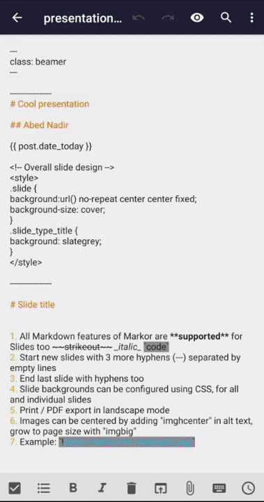

Markor makes creating presentation slides with plaintext faster & easier than ever.  
Presentations can be exported & shared as PDF & HTML.
This means you can create & prepare for presentations fast with Markor, open it on a PC or share it via E-Mail & WhatsApp.

The example presentation (as seen in the video) is bundled with Markor. 
Press the `+` button at the file browser to create a new file, select the `presentation-beamer.md` template and you get the whole _Abed Nadir_ presentation.  
It's the easiest way to start your presentation as most common slide styles are included. (Like custom slide background color & image, centered image, bullet points, title only slides, ..)

Excerpt of the presentation, includes information about the syntax:


```
---
class: beamer
---

-----------------
# Cool presentation

## Abed Nadir

{{ post.date_today }}

-----------------
## Slide title


1. All Markdown features of Markor are **supported** for Slides too
2. Start new slides with 3 more hyphens (---) separated by empty lines
3. End last slide with hyphens too
4. Slide backgrounds can be configured using CSS, for all and individual slides
5. Print / PDF export in landscape mode
6. Create title only slides (like first slide) by starting the slide (line after ---) with "# title"


-----------------
## Slide with centered image
* Images can be centered by adding 'imghcenter' in alt text & grown to page size with 'imgbig'
* Example: ``


-----------------
```


## Audio Recording / Voice Notes

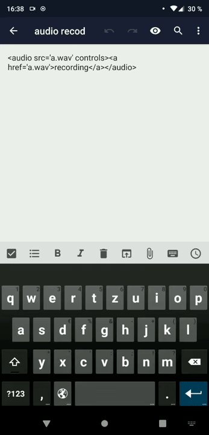

Add voice notes to your documents (all formats)!
You can find the audio recording option in the attachment menu. 

**Highest priority: Privacy!**  
**Audio recording is always started and stopped manually by the user and data is saved to local device!**  
Audio recording requires the _audio recording permission_, it must be granted before recording can start.
 
* Play the recording prior to saving with the left button
* Starts and stop audio recording with the right button. If you did a spelling error and want to re-record just press the record button again. Only the last recording will be added to the document
* Markor will suggest a time based filename for saving but you can choose any filename (`*.wav`) you want
* Markor inserts the audio recording with HTML syntax. You can listen to it at Markor's View Mode


## Create Markdown tables fast

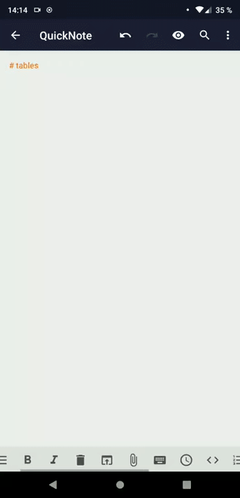

There is now a easy way to add tables to your Markdown documents!  
Use the new editor table button to add tables!

* Long press the table button to start a table (=create table header)
* Short press the table button to add a new row to the table
* You can choose the amount of columns as you wish. Max 5 recommended.
* The last used column count is highlighted

**Important**: Markdown tables must have a header (`---|---|---`). If you however don't want to write any header text, remove the line above the header (` | | `).

<!-- `` -->


## Other new features, enhancements & bugfixes
- Added Presentations & Slides with Markdown
- Added audio recording dialog which allows to add voice to documents. Manual interaction required to start & stop voice recording. Voice recording permission required for this feature
- Added editor button to create Markdown tables
- Markdown Footnotes support added
- Added attachment button for all formats (insert color, link, image, file, audio, date)
- Date/Time button long press now inserts text with last used format
- Improved SD Card reading & writing
- Added option to File-import-dialog to import to notebook instead of current folder
- Reordered editor buttons so global actions are on same position at all formats
- Source code highlighting for View mode
- Added settings option to enable experimental features
- New experimental feature: Convert epub to plaintext and replace current text with ebook
- New experimental feature: Speed Reading for (text from) edit mode
- New Special Keys option: Indent / Deindent current line
- Copy textfile to clipboard from file browser
- Added highlighting todo.txt due dates
- Long press the todo.txt date button to insert due date
- Sepia editor theme


------------------------------------------------------------------------------------------------------------------------------------

------------------------------------------------------------------------------------------------------------------------------------

------------------------------------------------------------------------------------------------------------------------------------


# Markor v2.1 - Key-Value highlighting (json/ini/yaml/csv), improved performance
_04. September 2019_

### New features, enhancements & bugfixes in this release
- Improved editor, highlighting and overall performance
- New file dialog: Templates
- New format: KeyValue - highlighting for json, ini, csv, yaml, vcard, ics, toml and other simple key-value like syntax
- Long click on main view plus button -> open favourites/recents
- Use lightweight Markdown heading highlighting on non-highend devices
- Show SD Card dialog when opening file that is under SAF
- Share: Rename PDF -> Print/PDF 
- Text action to sort todo by date
- Keep view mode scroll position
- Remove LinkBox from main screen to improve performance
- Make filesystem selection dialog fill screen
- Rework share into: Use file browser to select favourite/recent/popular files
- Special keys added: Insert page break for PDF/Printing, ohm key, punctation mark arrows
- Append linefeed on end when saving
- Show error when trying to rename to existing file/folder
- Add special handling for percent encoded filenames in nextcloud/owncloud folder
- Link 'More->Help' to Project website FAQ
- Debug Log settings option
- Improve local/linked file opening when clicking link at preview
- Add option to set font size in view mode
- Share (multiple) files from file browser
- PlaintextConverter: Put HTML into preview as is (allow to view html files)
- Fix folder title not visible sometimes
- Enable hex color highlighting for various prefix/postfixes (like colon, quote, ...)


------------------------------------------------------------------------------------------------------------------------------------

------------------------------------------------------------------------------------------------------------------------------------

------------------------------------------------------------------------------------------------------------------------------------


# Markor v2.0 - Search, dotFiles, PDF export
_03. July 2019_


## Recursive file search
File search has returned to Markor! Search is decoupled from file browser and supports recursive file search.  
In the editor there is also a new dedicated button in the menu toolbar for search.  
Now there is always a search button available in all type of pages, even better it's always at the same position.

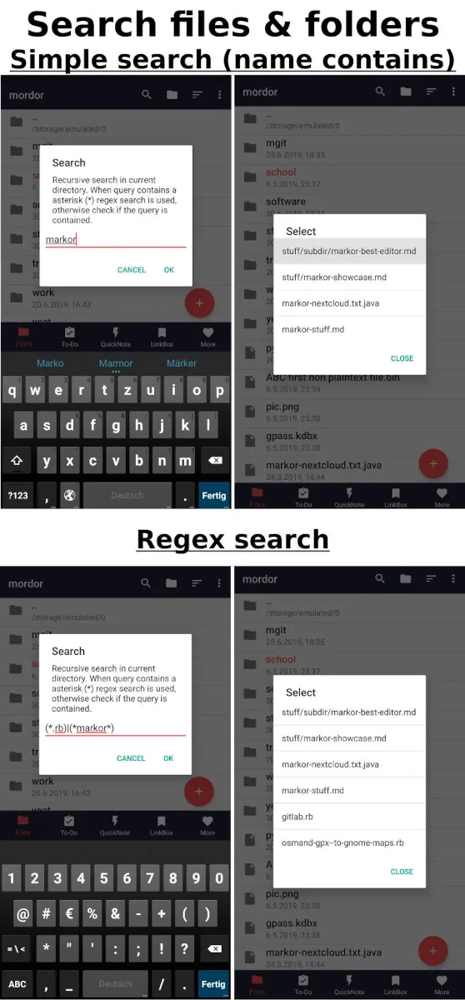  


### Improved image, PDF sharing and printing
The color scheme is now automatically switched to light with white background, when sharing or exporting a document as PDF or image.
As PDF export and printing uses the same Android feature, the improvement is also available for priting.

With this change, Markor will always automatically generate clean white documents for you (without theme specific background color), perfect for printing.


### Improved file handling
Markor will ask now if a file should be opened inside editor, if it's one of the extended list of expected file typs.
You will now get a dialog to choose between Markor or external app. This list of file types includes but is not limited
to data exchange (like csv, json, xml, yaml) anddevelopment (c++, java, python, ruby, golang, bash) files types.

There is also a new settings option in the general section, which allows to specify a comma seperated list of
file extensions that always should be opened with Markor.
If you want to open files with .mytype extension, as well files without extension: `None, .mytype`.

### More changes
- Always view files starting with "index."
- Setting to configure wrap mode (=line breaking)
- Menu option for reload file (editor/viewer)
- Menu option for hiding files & folders starting with a dot
- Setting to set tab width
- Improve back button when always start view mode is set
- Keep file browser sort order
- Improve inline code highlighting
- Add new line when archiving tasks


------------------------------------------------------------------------------------------------------------------------------------

------------------------------------------------------------------------------------------------------------------------------------

------------------------------------------------------------------------------------------------------------------------------------


# Markor v1.8 - All new file browser, favourites and faster Markdown preview
_03. July 2019_

## All new file browser

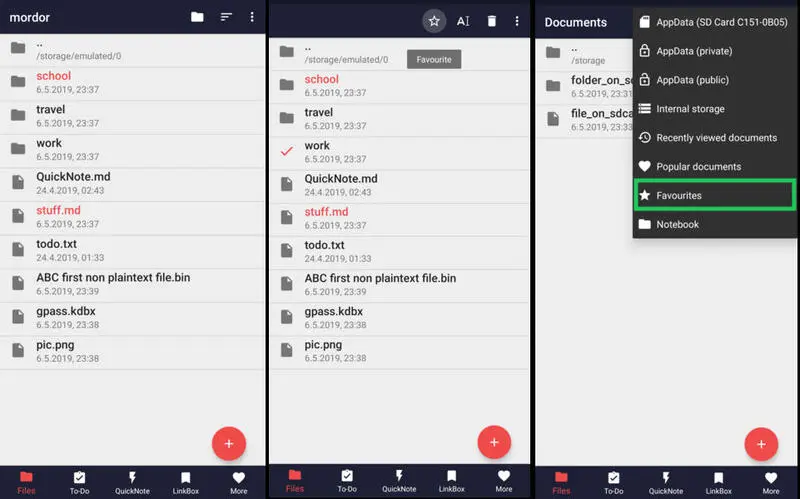

* The old file browser was removed and replaced by a new compact solution. It is based on the file browser known from import dialog.
* The previous "Notebook" tab in the main screen is now called "Files". Notebook is now just your document "home" folder. 
* You can now freely navigate the filesystem and all files are shown (previously: only folders and text documents).


#### Favourites
* Add any file or folder to your favourites! Long press a file/folder and tap the star button to add to or remove from favourites.
* Favourite files are highlighted by Markor's red accent color.
* Use the new quick navigation menu option to quickly navigate to your favourites, recently viewed files and more.
* Favourites are listed as normal files/folders in the file browser. They appear virtual under the special folder `/storage/favourite-files`. When a folder gets selected, the file browser will navigate to the real folder. Files get opened.
* You can also set `Favourites` as default folder to load on app start. Check out the blog post section about settings!


## Improved SD Card support

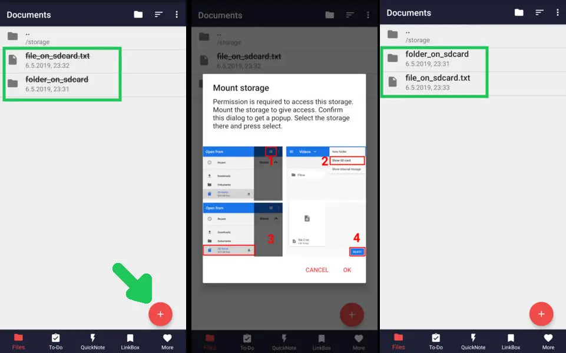

* Markor now uses the Android Storage Access Framework to access SD cards.
* To mount a SD card (so files can be edited by Markor), navigate to the SD card folder.
* (first screenshot) Press the `+` button and a descrptive dialog appears.
* (second screenshot) Follow the steps shown in the dialog to give Markor access to your SD card.
* (third screenshot) Files on the SD card are not striked out anymore, which means Markor has write access to the file/folder.

## New and updated Settings

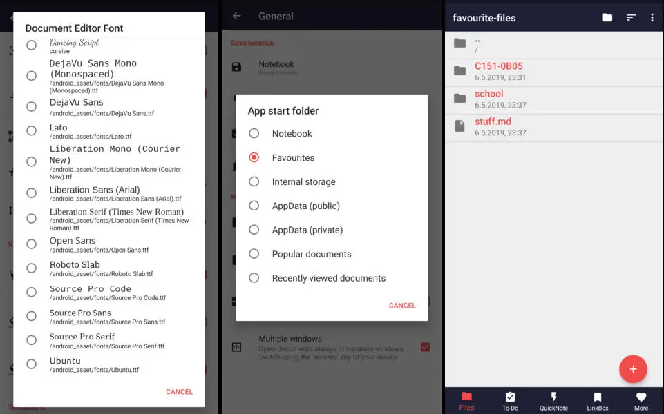

#### App start folder
You can find this new option at `General -> App start folder`. It allows you to select the special folder to load when Markor starts. The default is Notebook.  
Do you want multiple Notebooks? Favourite multiple folders and set the start folder to `Favourites` ツ.


## More changes

- Show app intro at first start
- All new file navigation
- Add favourite files
- Add quick navigiation options (to notebook, sdcard, AppData and more)
- Add option to set Navigation-Bar color
- Combine edit & view mode to one fragment, show view as overlay
- Add horizontal scrolling for code blocks in view mode
- More efficient undo/redo
- Option to enable/disable swipe to change mode
- WikiLinks: Disable default escaped characters, so subfolder path is not converted to hyphen
- Added fonts: Source Pro, DejaVu Sans Mono, Ubuntu, Lato
- Scan storage Fonts folder for custom fonts
- Add word count to document info dialog

#### Update statistics
* Two first-time-contributors and zero previous contributors improved the source code of the Markor project in this update. [Learn how you can improve the project by code](https://github.com/gsantner/markor#contributions)
* In this update totally 72 commits were made, 130 changed files, 5.001 additions and 2.249 deletions.
* There were totally 7 minor releases in prepartion of this update.
* 36 new strings were added for translation. 67 contributors are now translating the Markor project. [Help by translating Markor into your language](https://crowdin.com/project/markor).  


------------------------------------------------------------------------------------------------------------------------------------

------------------------------------------------------------------------------------------------------------------------------------

------------------------------------------------------------------------------------------------------------------------------------


# Markor v1.7 - Custom Fonts, LinkBox with Markdown
_11. March 2019_

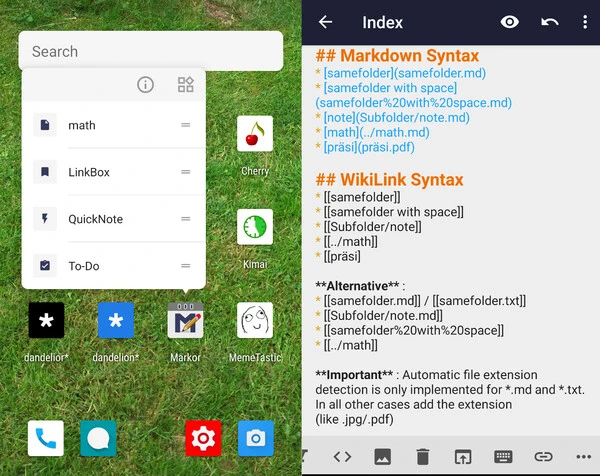


#### App Shortcuts
(left screenshot) Use the new [App Shortcuts](https://developer.android.com/guide/topics/ui/shortcuts) feature to quickly open one of the special documents or a recent document.
Long press one of the options to add the shortcut directly to your launcher desktop!

**Did you know** that you can create a launcher desktop shortcut for any document?
Press the share button while a document is open and select the _Create shortcut_ option.

The feature requires at least Android Nougat (v7.1).
You can't use App Shortcuts on older Android versions.
The traditional launcher shortcut option works on any Android version!  

#### WikiLink syntax
(right screenshot) Refer to other documents using the WikiLink syntax (known from Wikipedia & Mediawiki).  
The screenshot shows some ways how you can refer to other documents and files, using Markdown and WikiLink syntax.

**Important**: Automatic file extension detection is only available for text documents (.md, .txt).
Add the extension (like .jpg/.pdf) for all other file types!  


## Improved LinkBox

**Share into: Link Markdown syntax**  
When sharing links from your browser to Markor, they are now automatically converted to Markdown syntax!
This feature requires that your (browser) app sets the link and text attribute separately (yes, it works with Firefox, Chrome).


**LinkBox changed to use Markdown format by default**  
On new installations, LinkBox is now a file in Markdown format named `LinkBox.md`.
This allows you to easily browse links with title only, without distracting http urls.
Just switch to the representation/preview mode!  
As shared links default to Markdown syntax, just share to LinkBox and browse distraction free without changing anything!

**LinkBox listed in main navigation**
Often request and now available: LinkBox is now listed in the main navigation too!


## Open links quick & fast
**Did you know** that you can press the _open in external app/browser_ button to open the link in a different app?  
Just touch (place the cursor) at or after the link you want to open.
The link before or at to the current cursor will be opened, you can but don't need to click directly at the link beginning or ending.

**This functionality is available for any document in any format.**  
It is also available at `Share Into`, so you can replace `Open Link With` / `open shared link` kind of apps with Markor.


## Use custom fonts
You can now add custom fonts to Markor!

Custom fonts do change the default text appearance in edit & representation mode.
They work just as normal fonts do, but you need to install for them to appear.

**Install font**: Copy font to one of these locations:

* (Markor Notebook)/.app/fonts/
* /storage/emulated/0/Fonts/
* /sdcard/Fonts/

**Select font**: Settings option at Editor -> Document Editor Font

* 1: System (default) fonts are always listed on top.
  * The default option is Roboto Regular (sans-serif-regular)
* 2/3: Custom fonts are listed below system fonts. The font name is taken from the filename. To identify the correct font the absolute path is shown as well. Custom fonts are ordered as listed in _Install font__
* 4: Bundled fonts


#### Bundled fonts
Markor comes now bundled with some additional common fonts (free & open license only):

<table>
<tr><th>Font</th><th>Alternative to</th><th>Known from</th></tr>
<tr><td>Liberation Mono</td><td>Courier New</td><td>Microsoft Wordpad</td></tr>
<tr><td>Liberation Sans</td><td>Arial</td><td>Google Docs</td></tr>
<tr><td>Liberation Serif</td><td>Times New Roman</td><td>Previous default Microsoft Word font</td></tr>
<tr><td>Open Sans</td><td>Calibri</td><td>Default Microsoft Word font</td></tr>
<tr><td>Roboto Slab</td><td></td><td>Google Keep</td></tr>
<tr><td>DejaVu Sans</td><td></td><td>Linux desktop, Firefox</td></tr>
<tr><td>DejaVu Sans Mono</td><td></td><td>Linux terminals (=Monospaced)</td></tr>
<tr><td>Ubuntu</td><td></td><td>Default font on Ubuntu desktops</td></tr>
<tr><td>Lato</td><td></td><td>Popular font for websites</td></tr>
<tr><td>Source Sans Pro</td><td></td><td>Popular font for websites</td></tr>
<tr><td>Source Serif Pro</td><td></td><td>Popular font for websites</td></tr>
<tr><td>Source Code Pro</td><td></td><td>Popular font for editing code</td></tr>
</table>


## New settings options

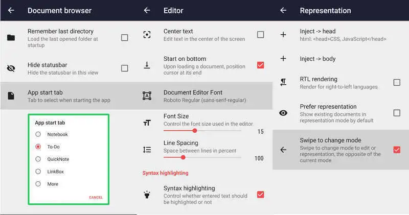


<table style="table-layout: fixed;">
<tr><td>Document browser --> App start tab</td><td>Select which tab should be selected when starting Markor.</td></tr>
<tr><td>Editor -> Document Editor Font</td><td>Select which font should be used at edit/representation mode</td></tr>
<tr><td>Representation -> Swipe to change mode</td><td>Whether or not the mode should be changed to the opposite (edit/representation) when swiping to left or right.</td></tr>
</table>

### More changes
- Improved app color theme for better readability  
- Load custom fonts from file  
  - Markor bundles 5 additional open fonts  
  - Copy custom fonts to folder: 'Notebook/.app/fonts/'  
- Links shared from e.g. browsers are automatically converted to Markdown syntax if possible  
- LinkBox is now listed on the main view bottom bar  
- LinkBox defaults on new installations to LinkBox.md as filename  
- Default to last used date/time format at dialog  
- Apply todo.txt format only for .txt files  
- L/R Swipe in edit/representation mode to change mode  
- Open link textaction: Don't include trailing ')' in parsed URL, which is common for markdown  
- Added App Shortcuts, requires Android 7.1+  
- Markdown: Enable WikiLink style to reference `[[file]]` relative  
- Strip #ref from URL in representation to determine if another file should be opened on click  
- Option to set app start tab (Notebook / ToDo / QuickNote / LinkBox / More)  


------------------------------------------------------------------------------------------------------------------------------------

------------------------------------------------------------------------------------------------------------------------------------

------------------------------------------------------------------------------------------------------------------------------------


# Markor v1.6 - DateTime dialog - Jekyll and KaTex improvements
_30. December 2018_


## New TextAction: DateTime

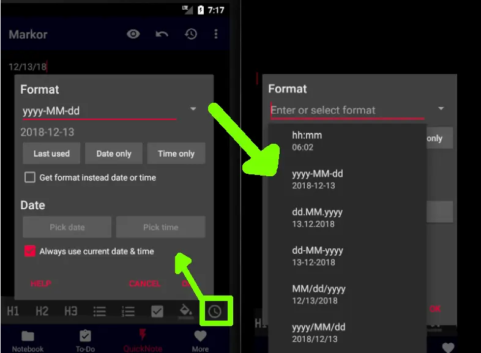  

Insert date and/or time using the new action! You can freely pick date and time and choose in which format the information should be added.
The current time is used when you press the "OK" button by default. (Note that you also can just insert the format, without date!)

* `Date only` selects your country specific default format for Date
* `Time only` selects your country specific default format for Time
* `Last used` select the format you last inserted into text (=OK pressed)

**New features:**  
- TextAction: Insert date/time  
- Add website title when sharing into Markor, if browser supports it  
  - Website title + URL formatted in Markdown format if possible

**Improved:**  
- Automatically create ToDo/linkbox/QuickNote and parent folders when using respective launcher  
- KaTex/Math: Improve inline math  
- Close virtual keyboard after creating new file  
- Language selection: Load system's most important language as system hint  
- Markdown + Jekyll: Replace {{ site.baseurl }} with .. in representation  
- More padding at settings on older devices  
- Use the new file dialog for sharing into new documents
- Filesystem dialog now shows images / textfiles only at respective file selection  

**Fixed:**  
- New file dialog: Jekyll option on older devices  
- Title not updated when swiping  


------------------------------------------------------------------------------------------------------------------------------------

------------------------------------------------------------------------------------------------------------------------------------

------------------------------------------------------------------------------------------------------------------------------------


# Markor v1.5 - Multiple windows, Markdown tasks, theming
_09. December 2018_


## Multiple windows, keep screen on

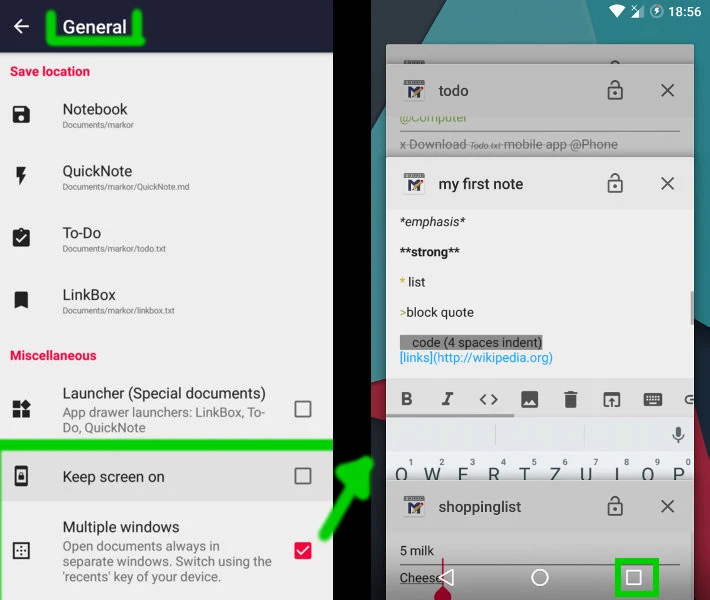

New general settings options arrived! You can find them under the following settings sections:
* **General -> Multiple windows**: Open a separate window for each document! Easily switch between multiple documents to quickly get needed information! Each window is a full editor with separate editor settings and format selection. Requires Android 5 or higher, activated by default.
* **General -> Keep screen on**: Do not turn off the screen automatically.

## New Textactions

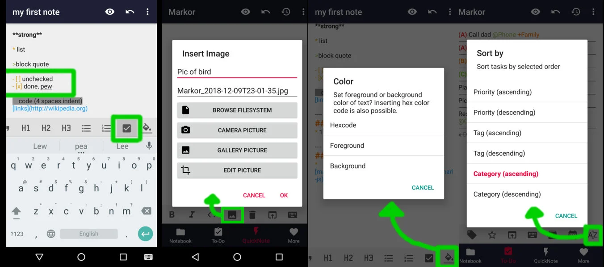

* **Markdown GFM tasks**: Use the new task textaction to convert the current line to a task! If the line is already a task you toggle between done and todo.
* **Insert image**: Add pictures to your document. Easy access to pictures from _gallery_ and _camera_! You can also browse your drive! Optionally _edit the picture_ with an installed graphics app.
* **Color picker**: Add _color_ to your texts! Choose between setting the _forground or background_ color. You can also add only the hex color code. The newly added _color picker_ is also used in [new theming functionalities](#new-theming-options-color-scheme-auto-theme)
* **Sort tasks**: Try the new sort button for your todo list! Easy sort your todo alphabetically by selected order. 


## All new 'new file' dialog

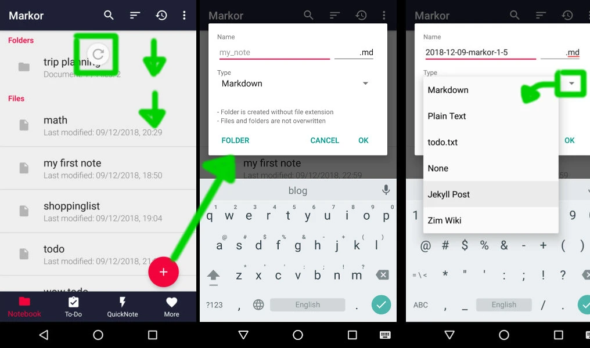

* **Create new file**
  * Create new files now from the Notebook
  * Choose between filename presets. Want to write a Jekyll blog post? Markor has you covered.
  * Full customizeable filename and file extension.
  * Moved 'New folder' from the toolbar-dropdown aswell. Enter the foldername in the first (left) text line and press 'Folder' to create it. The right text line (extension) is not used in this case.
  * More features to be added...!
  * Notice: Removed file move / rename within text editor. Use the new dialog for new files, otherwise the rename option. Long press one document in the Notebook to get the Rename option in the toolbar!
* **Pull down to refresh:**
  * Refresh list of documents by pulling down the list at 'Notebook'.
  * Replaces the 'refresh' action in the minimized toolbar section.


## New theming options: Color scheme, Auto theme

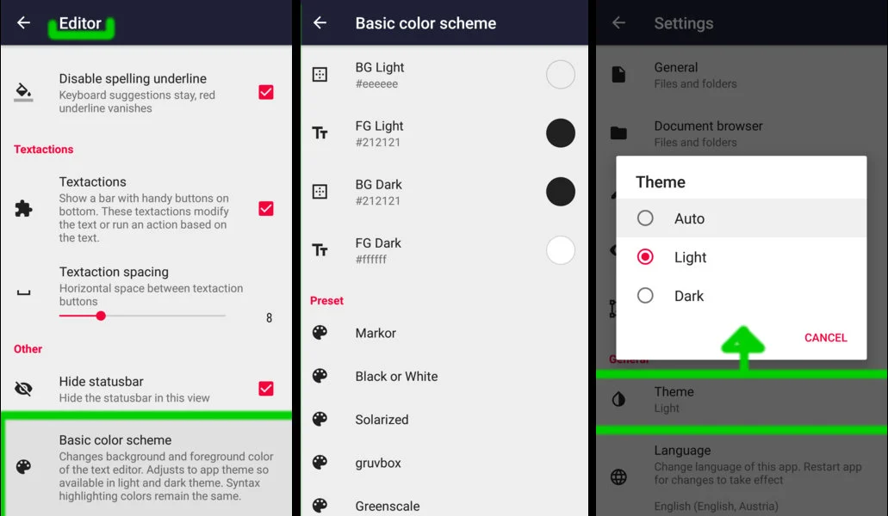

* **Editor -> Basic color scheme**: Select between predefined colors or use your own. Change the default textcolor and the background color at the editor. You can always return to the defaults by selecting the _Markor_ preset.
* **App theme**: Use the new _Auto_ option to automatically switch between themes based on the time of day. Always crisp at work and easy on eyes after work. New app installations use Auto as default.

**New features:**  
- App-wide  
  - Settings option: Keep screen on
  - Add popular documents to 'share into' 
  - Add 'Auto' theme, switch light/dark theme by current hour  
  - Support for Chrome Custom Tabs 
- Editor  
  - Open multiple Windows  
  - Settings options for editor background and foreground color  
  - todo.txt: Highlight multiple levels of context/projects (@@/++)  
  - Start document at the recent cursor position (jump to bottom on new documents and at special files)  
  - Enable link highlighting in plaintext format (especially easier to distinguish title and links in linkbox)  
- Document browser  
  - Completly new 'New file' dialog  
- Text Actions  
  - Sort todo.txt files  
  - Tasks support in Markdown  
  - Add zero-width space character to 'special characters'  
  - Add color picker  
  - Markdown: Long press image adds img-src with max-height  
  - Long press 'Special key' jumps to top/bottom  
  - Long press 'Open external' opens content search  
  - Don't list empty lines in simple search  
  - Edit picture supports now relative filepaths too  
  - Show import dialog for selected pictures too (like in file selection)  

**Improved:**  
- Document browser  
  - Replace 'Reload button' with pull down to refresh  
  - Added 'Last modified' to File information dialog  
- Editor  
  - Added greenscale basic editor colors  
  - More space for document title  
  - Harden automatic file naming and moving  
- Representation  
  - Set inital background color before loading document  
  - Math/KaTex: Show inline when single dollar is used
  - Enable block rendering for KaTex (math)  
  - Performance improvement for TOC & Math - only use when text contains headers/math  
  - Markdown: Underline h2 too (like h1, more common for two levels)  
  - ToDo: Add alternative naming for contexts/projects  
- TextActions  
  - Markdown: Multiline textaction for header/quote/list  
- App-wide  
  - Natural scrolling in dialogs  

**Fixed:**  
- Filesystem  
  - Discard selection when leaving filesystem view  


------------------------------------------------------------------------------------------------------------------------------------

------------------------------------------------------------------------------------------------------------------------------------

------------------------------------------------------------------------------------------------------------------------------------


# Markor v1.2 - Markdown with KaTex/Math - Search in current document
_18. September 2018_


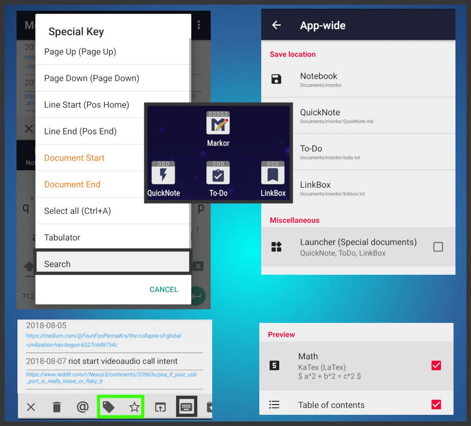

**New features:**  
- General
  - Launchers to directly open LinkBox/ToDo/QuickNote (opt-in)
- Text Actions
  - Search/filter lines by input (available in special-keys button menu)  
  - Todo: context aware search for projects,contexts (longpress project/context button)
- Preview
  - Table of contents (opt-in))  
  - Math using KaTex (opt-in)

**Improved:**  
- Converter
  - Markdown: More features enabled, notably GFM like table parsing and underlined h1
- Settings
  - More spacing between categories

**Fixed:**  
- Editor
  - File saving

## Location of new features

### Search
Basic content search features arrived. All do search line-by-line and jump to the found line at selection.

* **Search ToDo**: Long press context/project action to open context-aware-search. A list with existing projects/contexts will be shown as pre selection.
* **Content search**: Press the 'special key' button and select 'Search' action.


### Settings
Overall setting category headers have more spacing now and some options were reordered.

* **Format -> Markdown -> Math** - Show math formulas at preview, parsed using KaTex (example: `$ a^2 + 5 = x $`)
* **Format -> Markdown -> Table of contents** - Shows a table of contents at preview
* **App-wide -> Save location** - Notebook directory and all special files are available here for selection
* **App-wide -> Launcher (Special documents)** - Enable additional launchers for LinkBox/ToDoQuickNote. A restart of the launcher or device may be required for this feature to take affect.


------------------------------------------------------------------------------------------------------------------------------------

------------------------------------------------------------------------------------------------------------------------------------

------------------------------------------------------------------------------------------------------------------------------------


# Markor v1.1 - Markdown picture import from gallery and camera
_09. September 2018_

**New features:**  
- Text Module Actions
  - Markdown Picture Dialog
  - Load picture from gallery
  - Take picture with camera 
  - Edit picture with graphics app 
- Add popular files (most used files by access count) 
- Add popular & recent files as virtual folder under /storage/ 
  - Selectable e.g. for widgets 
 
**Improved:**  
- Formats 
  - Load Markdown Format for .md.txt files 
- Text-Module-Actions
  - More safety checks at execution 
- Highlighting 
  - MD: Better code readability 
  - MD: Better unordered list readability
 
**Fixed:**  
- Editor 
  - Change default lineheight back to 100% 
  - Not connects multiple lines anymore 
- Filesystem view 
  - More checks for storage access and the yellow info box 


------------------------------------------------------------------------------------------------------------------------------------

------------------------------------------------------------------------------------------------------------------------------------

------------------------------------------------------------------------------------------------------------------------------------


# Markor v1.0 - Widget shortcuts to LinkBox, ToDo, QuickNote
_09. September 2018_


**Recent changes in the Markor project:**  
**New features:**
- ShareInto
  - Added export: calendar appointment

**Improved:**
- Widget
  - Added shortcuts to ToDo, QuickNote and LinkBox
- SD Card handling and permission errors
  - Show warning when opening a file on not writeable path
  - Add shortcuts to writeable SD card folders
  - Mark unwriteable files red in selection dialog
- ShareInto
  - Better seperator placment

**Fixed:**
- Widget
  - Open selected file
- Editor
  - Markdown header highlighting padding
- Share to app
  - Fix view intent not starting on some devices
- Filesystem view
  - Allow to view Details for folder too

## Upcoming changes
The following will very likely be included in the next release - may also be in progress but not guaranteed to be done ;).
* Improved and more safe Text-Module-Actions
* More functions for recent-files, Addition of popular-files
* (Markdown) Improved code block highlighting
* (Markdown) Improved unordered list highlighting


------------------------------------------------------------------------------------------------------------------------------------

------------------------------------------------------------------------------------------------------------------------------------

------------------------------------------------------------------------------------------------------------------------------------


# Markor v0.3 - Faster loading, LinkBox added, Open link in browser TextAction
_18. May 2018_

**Recent changes in the Markor project:**  
- Editor::Option to disable _red underline_ of spellchecker
- Editor::Limit history size to improve performance
- Preview::Support UTF8 local file references in preview mode
- More file managers and sync clients supported (notable addition: seafile)
- TextModule-Action:: Decrease action padding - place for more action
- TextModule-Action:: Add 'delete line' for all editor formats
- TextModule-Action:: Add 'open link in browser' to all editor formats
- Share into:: Add LinkBox option

**New features:**  
- Recently viewed documents
  - Start editing of recent documents, button in the toolbar of main view
  - Allow sharing into recend documents
  - Queue containing the 10 last viewed files
- Keep scroll position when reloading document list (Notebook)
- Document/File Info: Dialog showing information about selected file
  - Openable at main views toolbar when one item is selected

**Improved:**  
- Overall better performance 
  - Faster document loading
  - Decreased memory usage
- Reduce edit history size (undo/redo) to 5 for lower memory usage
- Preview/Rendering (All):
  - Rework of theme, font-size and font injection
- Preview/Rendering (Markdown):
  - Blockquote theme based styling
  - Blockquote RTL compatibility

**Fixed:**  
- Crash when Markor put to background and huge file is loaded
  - Document contents are not stored into resume cache anymore if they are too big
  - Make no major differences for huge files, just undo/redo history is cleared when switchting away
