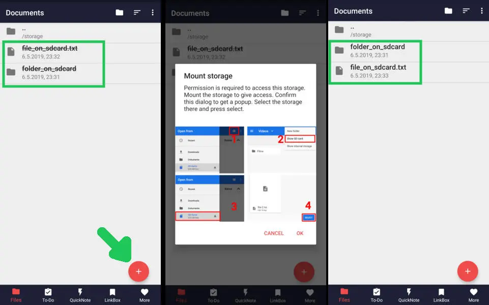

# Markor

<b>Text editor - Notes &amp; ToDo (for Android)</b>.
 Simple and lightweight, supporting Markdown, todo.txt, Zim & more!  

**Download:**  [F-Droid](https://f-droid.org/repository/browse/?fdid=net.gsantner.markor), [GitHub](https://github.com/gsantner/markor/releases/latest)

Markor is a TextEditor for Android.
This project aims to make an editor that is versatile, flexible, and lightweight.
Markor utilizes simple markup formats like Markdown and todo.txt for note-taking and list management.
It is versatile at working with text; it can also be used for keeping bookmarks, copying to clipboard, fast opening a link from text and lots more.
Created files are interoperable with any other plaintext software on any platform.
Markor is openly developed free software that accepts community contributions.

  
  

## Features
📝 Create notes and manage your to-do list using simple markup formats
 🌲 Work completely offline -- whenever, wherever
 👌 Compatible with any other plaintext software on any platform -- edit with notepad or vim, filter with grep, convert to PDF or create a zip archive
 
 🖍 Syntax Highlighting and format related actions -- quickly insert pictures and to-dos
 👀 Convert, preview, and share documents as HTML and PDF
 
 📚 Notebook: Store all documents on a common filesystem folder
 📓 QuickNote: Fast accessible for keeping notes
 ☑️ To-Do: Write down your to-do
 🖍 Formats: Markdown, todo.txt, Zim/WikiText, Plaintext, csv, ics, ini, json, toml, vcf, yaml
 📋 Copy to clipboard: Copy any text, including text shared into Markor
 💡 Notebook is the root folder of documents and can be changed to any location on the filesystem. QuickNote and To-Do are textfiles
 
 🎨 Highly customizable, dark theme available
 💾 Auto-Save with options for undo/redo
 👌 No ads or unnecessary permissions
 🌎 Language selection -- use other language than on the system
 
 🔃 Markor is an offline app. It works with sync apps, but they have to do syncing respectively. Sync clients known to work in combination include BitTorrent Sync, Dropbox, FolderSync, OwnCloud, NextCloud, Seafile, Syncthing, Syncopoli
 🔒 Can encrypt your textfiles with AES256. You need to set a password at the settings and use Android device with version Marshmallow or newer. You can use [jpencconverter](https://gitlab.com/opensource21/jpencconverter) to encrypt/decrypt easily on desktop. Be aware that only the text is encrypted not pictures or attachments.

## Contribute
* **Programming**  
  The project is always open for contributions and welcomes merge requests. Take a look at our [issue tracker](https://github.com/gsantner/markor/issues) for open issues, especially "[good first issues](https://github.com/gsantner/markor/issues?q=is%3Aopen+is%3Aissue+label%3A%22good+first+issue%22)".
* **Feature requests & discussions**  
  Start a discussion [here](https://github.com/gsantner/markor/discussions).
* **Bug reports**  
  Report issues [here](https://github.com/gsantner/markor/issues). Please [search](https://github.com/gsantner/markor/issues?q=) for similar issues & [requests](https://github.com/gsantner/markor/discussions?discussions_q=) first. If it's not a bug, please head to discussions.
* **Localization**  
  Translate on [Crowdin](https://crowdin.com/project/markor/invite) (free).

## Develop
Clone the project using git. Then open the project in [Android Studio](https://developer.android.com/studio) (recommended), install required Android SDK dependencies where required.
You may also use any other plaintext editor of your preference.

There is a Makefile in the project which makes it easy to test, lint, build, install & run the application on your device. See the Makefile for reference.
You can find binaries (.apk), logs, test results & other outputs in the dist/ directory.  
Example: `make all install run`.

The project code style is the [AOSP Java Code Style](https://source.android.com/source/code-style#follow-field-naming-conventions). Use the _auto reformat_ menu option of Android Studio before commiting or before you create the pull request.

### Technologies / Dependencies
* Java, Android SDK, AndroidX
* No dependency on NDK, 1 APK = all Android supported Architectures
* Editor: Advanced component based on Android EditText
* Preview: Android WebView
* Editor syntax highlighting: Custom implementation for all supported formats
* Markdown parser: [flexmark-java](https://github.com/vsch/flexmark-java/wiki/Extensions)
* Zim/WikiText parser: Custom implementation, transpiling to Markdown
* todo.txt parser: Custom implementation
* Binary support: WebView html img/audio/video with support for most common formats
* CI/CD: GitHub Actions
* Build system: Gradle, Makefile

### Resources
* Project repository: [Changelog](CHANGELOG.md) | [Issues](https://github.com/gsantner/markor/issues?q=is%3Aissue+is%3Aopen) | [Discussions](https://github.com/gsantner/markor/discussions) | [License](/LICENSE.txt) | [GitHub Releases](https://github.com/gsantner/markor/releases) | [Makefile](Makefile)
* F-Droid: [Listing](https://f-droid.org/packages/net.gsantner.markor) | [Wiki](https://f-droid.org/wiki/page/net.gsantner.markor) | [Metadata](https://gitlab.com/fdroid/fdroiddata/blob/master/metadata/net.gsantner.markor.yml) | [Build log](https://f-droid.org/wiki/page/net.gsantner.markor/lastbuild)

## Privacy
Markor does not use your internet connection unless your own user-generated content references external resources (for example, when you reference an external image by URL).
The app works completely offline, no internet connection required!
No personal data is shared with the author or any third parties.
Files can be shared to other apps from inside the app by pressing the share button.
Files are stored locally in a user selectable folder, defaulting to the internal storage "Documents" directory.

#### Android Permissions
* WRITE_EXTERNAL_STORAGE, READ_EXTERNAL_STORAGE  
  Read from and write files to storage.
* INTERNET  
  In user-generated content data can be loaded from the internet.
* INSTALL_SHORTCUT  
  Install a shortcut to launchers to open a file/folder in Markor.
* RECORD_AUDIO  
  Attach voice notes to the text. The permission is only used after click on the "attach audio" button, at the audio record dialog. Audio recording is always started and stopped manually by you (button press).

## License
The code of the app is licensed Apache 2.0.  
Localization & translation files (string\*.xml) as well samples are licensed CC0 1.0 (public domain).  
Project is based on the unmaintained projects writeily and writeily-pro.

# FAQ

## File browser & file management

#### How do I save a file?
Markor automatically saves text when you leave Markor or close a file. Additionally there is save button in the top menu.

#### How do I save files to SD Cards?
Browse to the start folder of your SD Card and press the + button (using file browser or the menu option). Now press the plus button and follow the steps in the dialog. Afterwards Markor's file browser won't strike out filenames anymore and files are writable.

#### How to synchronize files?
Markor is and will stay an offline focused application. It works with sync synchronization apps, they have to do syncing respectively.
Sync clients known to work in combination include BitTorrent Sync, Dropbox, FolderSync, OwnCloud, NextCloud, Seafile, Syncthing, Syncopoli and others.  
The project recommendation is Syncthing. [-> Guide for Syncthing](doc/markor-how-to-use-syncthing-for-sync.md)

#### What is Notebook?
The root folder of your files! Markor starts with this folder at the main screen and allows you to browse files. You can work at any (accessible) file & location with Markor.

#### What is ToDo?
Your main to-do list file in todo.txt format. You can access it by swiping once at the main screen, by selecting todo.txt at Notebook, or by using the dedicated launcher. You can also open it from Notebook or other apps! You will also have the option to create a to-do task when sharing text into Markor when the text is just one line. The location of this file is freely choosable and independent from the Notebook directory.

#### What is QuickNote?
The fastest and easiest way to take notes! QuickNote is a file in Markdown format with a freely choosable file location. You can access it by swiping twice at the main screen, by selecting QuickNote at Notebook, or by using the dedicated launcher. The location of this file is freely choosable and independent from the Notebook directory.

#### Launchers
A launcher is a "start menu option" in your devices launcher (=appdrawer / start menu). When Markor is installed you have the start menu option for Markor. When the Markor settings option "Launcher (Special Documents)" is enabled, you get the additional start menu options for ToDo and QuickNote. Note that a device restart is required when you change this option.

## Format: Markdown
#### What is Markdown?
A general purpose markup format for documents of all kinds. As Markdown gets converted to HTML prior displaying a rendered view, you can also include HTML in the text, thus you can do everything web browsers can do.

CommonMark is the specification that the markdown parser used in Markor implements.

| **Resources** | |
|-----------------------------------------------------------------------|------------------------------|
| [CommonMark tutorial](http://commonmark.org/help/tutorial/)           | Learn Markdown in 10 minutes |
| [CommonMark help](http://commonmark.org/help/)                        | Quick reference and interactive tutorial for learning Markdown. |
| [CommonMark Spec](http://spec.commonmark.org/)                        | CommonMark Markdown Specification |
| [daringfireball](https://daringfireball.net/projects/markdown/syntax) | Syntax documentation the Markdown creator |

#### Links to files that contains spaces
Most Markdown applications use URL encoding for links, so does Markor. This means replace every space` ` with `%20`. This ensures that your Markdown content is compatible with most other Markdown applications.  

Markor has a dedicated button for adding links and file references, which automatically applies this appropiate format.  Take a look at this [video](https://user-images.githubusercontent.com/6735650/63089879-e6aa9400-bf48-11e9-87c1-78a1ba1c444f.gif) to find out where the file reference button is located and how to use it.  

Example: `[alt](my cool file.md)` ⮕ `[alt](my%20cool%20file.md)`.

#### Can I use Markor in class to write down equations? (Math)
Yes, Markor has advanced functionalities for math! Enable the feature by checking Settings»Format»Markdown»Math.  

Markor's [markdown-reference.md](samples/markor-markdown-reference.md) template (available from new file dialog) showcases some examples.  
Learn more about available functions and symbols here: [1](https://katex.org/docs/supported.html), [2](https://katex.org/docs/support_table.html)

## Format: todo.txt
#### What is todo.txt?
Todo.txt is a simple text format for todo. Each line of text is a task. The idea comes from [Gina Trapani](https://github.com/ginatrapani).

| **Resources** | |
|---------------------------------------------------------------------------------------|----------------------|
| [Homepage](http://todotxt.org/)                                                       | Todo.txt's home      |
| [Format](https://github.com/todotxt/todo.txt/blob/master/README.md)                   | Syntax documentation |
| [User Documentation](https://github.com/todotxt/todo.txt-cli/wiki/User-Documentation) | User documentation   |

#### How to mark a task done?
Done tasks are marked by a `x ` in begining of the line and can optionally be moved to a done/archive file.

#### What is a context (@)?
  With contexts you can mark a situation or place. You may use it to categorize your todos. Context is part of todo.txt format, add `@` in front of a word to create one.  
  Examples: @home @work

#### What is a project (+)?
  With projects you can group tasks by a specific project. You may use it to tag your todos with recognizable meta information. Context is part of todo.txt format, add `+` in front of a word to create one.  
  Examples: +video +download +holidayPlanning

