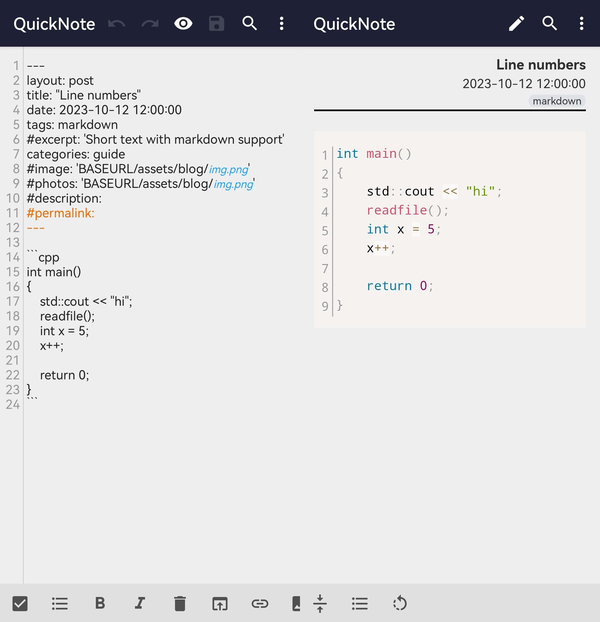
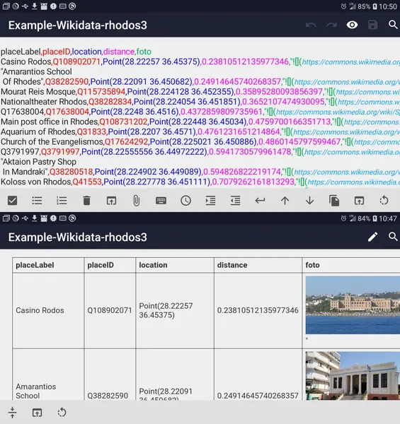

# Markor

[English](README.md) | 简体中文
  

<b>文本编辑器 - 笔记和待办事项（适用于Android）</b>.
 简单轻便，支持Markdown、todo.txt、Zim及更多格式！  

**下载:**  [F-Droid](https://f-droid.org/repository/browse/?fdid=net.gsantner.markor), [GitHub](https://github.com/gsantner/markor/releases/latest)

Markor 是一款专为Android设计的文本编辑器。
该项目旨在打造一个多功能、灵活且轻量级的编辑器。
Markor采用Markdown和todo.txt等简单标记语言来记录笔记和管理列表。
它在处理文本方面非常全能，也可用于保存书签、复制到剪贴板、快速打开文本中的链接等多种功能。
创建的文件可与任何平台上的其他纯文本软件互操作。
Markor是开源的免费软件，接受社区贡献。

  
  

## 功能
📝 使用简单标记格式创建笔记和管理待办事项列表
 🌲 随时随地完全离线工作
 👌 兼容任何平台上的其他纯文本软件 —— 使用记事本或vim进行编辑，使用grep进行过滤，转换为PDF或创建zip存档。
 
 🖠语法高亮åŠæ ¼å¼ç›¸å…³æ“作 —— 快速æ’入图片和待åŠäº‹é¡¹
 👀 转换、预览并以HTML和PDF格式分享文档
 
 📚 笔记本：将所有文档存储在一个公共文件系统文件夹中
 📓 快捷笔记：便于快速记录笔记
 ☑️ 待办事项：写下你的待办事项
 🖠支æŒæ ¼å¼ï¼šMarkdown、todo.txt、Zim/WikiTextã€çº¯æ–‡æœ¬ã€[CSV](doc/2023-06-02-csv-readme.md)、ICS、INI、JSON、TOML、VCF、YAML
 📋 复制到剪贴板：复制任何文本，包括分享到Markor的文本
 💡 “笔记本”是文档的根文件夹，可以更改为文件系统上的任何位置。而“快速笔记”和“待办事项”则是文本文件。
 
 🨠高度å¯å®šåˆ¶ï¼Œæ供深色主题
 💾 自动保存，并带有撤销/重做选项
 👌 无广告或不必要的权限请求
 🌠语言选择——å¯ä½¿ç”¨ä¸ç³»ç»Ÿä¸åŒçš„语言
 
 🔄 Markor是一款离线应用。它可以与同步应用一起工作，但这些同步操作需要各自进行。
 🔒 Markor能够使用AES256加密你的文本文件。你需要在设置中设置一个密码，并且使用Android 6.0（Marshmallow）或更高版本的设备。你可以使用[jpencconverter](https://gitlab.com/opensource21/jpencconverter)在桌面端进行加密/解密操作。请注意，只有文本内容会被加密，图片或附件不会被加密。

## 最新更新中的新功能 - Markor v2.11 - ASCIIDoc、CSV和组织模式、todo.txt高级搜索、行号显示

### 行号显示支持

Markor现在支持显示行号了。在顶部的文件菜单中，你可以找到一个新选项来启用行号显示。
此功能在编辑器中可用，同时在文档的查看模式下也能看到（在代码块中）。

### 新格式：AsciiDoc
AsciiDoc 是现在新增支持的格式之一。
虽然它的功能可能不像Markdown那样丰富，但它应该能满足一般使用需求。

### 新格式: CSV
现在支持[CSV file](https://en.wikipedia.org/wiki/Comma-separated_values)格式（支持语法高亮和预览）。
详情请见[CSV 说明文档](doc/2023-06-02-csv-readme.md)，该功能在以下提交中实现：#1988, #1987, #1980, #1667。

* 带语法高亮的编辑器
* 每个csv列以不同唯一颜色显示，以便清晰区分各列数据与其列标题的对应关系
* 可预览为HTML表格，并能导出为PDF
* CSV列中可包含Markdown语法（参见截图中的“示例”列）

### 新格式: Org-Mode
新增的第三种也是最后一种格式是Org-Mode。请注意，目前仅提供了编辑器语法高亮和便于编辑的动作按钮。
尚未实现专门的查看模式。

### 导航
* [**自述文件**](README.zh-CN.md)
  * [功能](#功能)
  * [贡献](#贡献)
  * [开发](#开发)
  * [隐私](#隐私)
  * [许可证](#许可证)
* [**常见问题解答**](#FAQ)
  * [文件浏览器，文件管理](#file-browser--file-management)
  * [格式: Markdown](#format-markdown)
  * [格式: Markdown](#format-markdown)
  * [格式: todo.txt](#format-todotxt)
* [**更多**](doc)
  * [同步的纯文本待办事项和笔记 - 使用 Vim / Vimwiki 在桌面端编辑，Markor 在 Android 设备上编辑，通过 Syncthing 实现多设备间同步，遵循 GTD 方法管理个人事务](doc/2020-09-26-vimwiki-sync-plaintext-to-do-and-notes-todotxt-markdown.md)
  * [Markor：如何使用 Syncthing 同步文件 (wmww,tengucrow)](doc/2020-04-04-syncthing-file-sync-setup-how-to-use-with-markor.md)
  * [使用 Markor 在 Android 设备上写作（及更多功能）（纯文本项目）](doc/2019-07-16-using-markor-to-write-on-an-android-device-plaintextproject.md)
  * [如何使用 Vim、Markdown 和 Pandoc 记笔记（Vaughan 的方法）](doc/2018-05-15-pandoc-vim-markdown-how-i-take-notes-vaughan.md)
* [**新闻**](NEWS.md)
  * [Markor v2.11 - 支持AsciiDoc、CSV与Org-Mode格式，Todo.txt高级搜索](NEWS.md#markor-v211---asciidoc-csv-and-org-mode-todotxt-advanced-search-line-numbers)
  * [Markor v2.10 - 自定义文件模板，分享时自动移除URL追踪参数](NEWS.md#markor-v210---custom-file-templates-share-into-automatically-remove-url-tracking-parameters)
  * [Markor v2.9 - 片段、模板、图表、图形、流程图、YAML前置信息、化学公式](NEWS.md#markor-v29---snippets-templates-graphs-charts-diagrams-yaml-front-matter-chemistry)
  * [Markor v2.8 - Todo.txt对话框的多选功能](NEWS.md#markor-v28---multi-selection-for-todotxt-dialogs)
  * [Markor v2.7 - 内容搜索与备份恢复设置](NEWS.md#markor-v27---search-in-content-backup--restore-settings)
  * [Markor v2.6 - 加入Zim Wiki支持，换行自动成段落，改进保存格式](NEWS.md#markor-v26---zim-wiki-newline--new-paragraph-save-format)
  * [Markor v2.5 - Zim Wiki功能增强 - 搜索替换与知识卡片(Zettelkasten)](NEWS.md#markor-v25---zim-wiki---search--replace---zettelkasten)
  * [Markor v2.4 - 全新Todo.txt体验 - 编程语言语法高亮](NEWS.md#markor-v24---all-new-todotxt---programming-language-syntax-highlighting)
  * [Markor v2.3 - 目录功能，自定义操作顺序](NEWS.md#markor-v23---table-of-contents-custom-action-order)
  * [Markor v2.2 - 演示文稿、语音笔记、Markdown表格编辑器](NEWS.md#markor-v22---presentations-voice-notes-markdown-table-editor)
  * [Markor v2.1 - 键值对高亮显示(json/ini/yaml/csv)，性能提升](NEWS.md#markor-v21---key-value-highlighting-jsoniniyamlcsv-improved-performance)
  * [Markor v2.0 - 搜索功能、dotFiles支持、PDF导出](NEWS.md#markor-v20---search-dotfiles-pdf-export)
  * [Markor v1.8 - 全新的文件浏览器、收藏夹及更快的Markdown预览](NEWS.md#markor-v18---all-new-file-browser-favourites-and-faster-markdown-preview)
  * [Markor v1.7 - 自定义字体、LinkBox集成Markdown](NEWS.md#markor-v17---custom-fonts-linkbox-with-markdown)
  * [Markor v1.6 - 日期时间选择器 - Jekyll与KaTeX功能增强](NEWS.md#markor-v16---datetime-dialog---jekyll-and-katex-improvements)
  * [Markor v1.5 - 多窗口模式、Markdown任务列表、主题定制](NEWS.md#markor-v15---multiple-windows-markdown-tasks-theming)
  * [Markor v1.2 - 集成KaTex数学公式支持的Markdown - 当前文档搜索功能](NEWS.md#markor-v12---markdown-with-katexmath---search-in-current-document)
  * [Markor v1.1 - 从图库和相机导入Markdown图片](NEWS.md#markor-v11---markdown-picture-import-from-gallery-and-camera)
  * [Markor v1.0 - 快捷小部件直达LinkBox、待办事项、快速笔记](NEWS.md#markor-v10---widget-shortcuts-to-linkbox-todo-quicknote)
  * [Markor v0.3 - 加载速度提升，新增LinkBox，文字操作中增加“在浏览器中打开链接”功能](NEWS.md#markor-v03---faster-loading-linkbox-added-open-link-in-browser-textaction)

## 贡献
* **编程**  
  该项目始终开放供稿，并欢迎合并请求。看看我们的 [issue tracker](https://github.com/gsantner/markor/issues) 对于未决问题，尤其是 "[良好初学者问题](https://github.com/gsantner/markor/issues?q=is%3Aopen+is%3Aissue+label%3A%22good+first+issue%22)".
* **功能需求与讨论**  
  Start a discussion [here](https://github.com/gsantner/markor/discussions).
* **错误报告**  
  报告问题 [此处](https://github.com/gsantner/markor/issues)。首先请[搜索](https://github.com/gsantner/markor/issues?q=)对于类似的问题和[请求](https://github.com/gsantner/markor/discussions?discussions_q=)，如果它不是一个错误，请前往讨论。
* **本地化**  
  在 [Crowdin](https://crowdin.com/project/markor) 上翻译（免费）

## 开发
使用git克隆该项目。然后建议在[Android Studio](https://developer.android.com/studio)中打开项目，并根据需要安装必需的Android SDK依赖项。
您也可以使用任何其他喜欢的纯文本编辑器。

项目中包含一个Makefile，便于进行测试、检查代码风格、构建、安装及在设备上运行应用程序。具体操作可参考Makefile中的说明。
二进制文件（.apk）、日志、测试结果及其他输出内容位于dist/目录下。
例如，执行命令`make all install run`即可完成构建、安装并运行应用的全部流程。

该项目遵循[AOSP Java代码风格指南](https://source.android.com/source/code-style#follow-field-naming-conventions)。请在提交代码或创建Pull Request之前，使用Android Studio中的“自动格式化”菜单选项来调整代码格式。

### 技术与依赖项

* 编程语言与平台：Java、Android SDK、AndroidX
* 原生支持：无需NDK依赖，单个APK支持所有Android架构
* 编辑器：基于Android EditText的高级组件
* 预览：利用Android WebView
* 编辑器语法高亮：自定义实现，支持所有文件格式
* Markdown解析器：[flexmark-java](https://github.com/vsch/flexmark-java/wiki/Extensions)
* Zim/WikiText解析器：自定义实现，转换为Markdown格式
* Todo.txt解析器：自定义实现
* 二进制文件支持：WebView中支持html的img/audio/video元素，涵盖大多数常见格式
* 持续集成/持续部署(CI/CD)：GitHub Actions
* 构建系统：Gradle及Makefile

### 资源
* 项目仓库： [更新日志](CHANGELOG.md) | [问题](https://github.com/gsantner/markor/issues?q=is%3Aissue+is%3Aopen) | [讨论](https://github.com/gsantner/markor/discussions) | [协议](/LICENSE.txt) | [GitHub Releases](https://github.com/gsantner/markor/releases) | [Makefile](Makefile)
* F-Droid: [Listing](https://f-droid.org/packages/net.gsantner.markor) | [Wiki](https://f-droid.org/wiki/page/net.gsantner.markor) | [Metadata](https://gitlab.com/fdroid/fdroiddata/blob/master/metadata/net.gsantner.markor.yml) | [构建日志](https://f-droid.org/wiki/page/net.gsantner.markor/lastbuild)

## 隐私

Markor不会使用您的互联网连接，除非您创建的内容引用了外部资源（例如，通过URL引用外部图片）。
该应用完全离线工作，无需互联网连接！
不会与作者或任何第三方共享个人数据。
您可以通过应用内的分享按钮将文件分享给其他应用。
文件存储在用户可选的本地文件夹中，默认为内部存储的“文档”目录。

#### 安卓权限
* WRITE_EXTERNAL_STORAGE, READ_EXTERNAL_STORAGE  
  用于读取文件和写入文件。
* INTERNET  
  在用户生成的内容中，可以从互联网加载数据。
* INSTALL_SHORTCUT  
  创建快捷方式，以便直接在Markor中打开文件或文件夹。
* RECORD_AUDIO  
  将语音笔记嵌入到文本中。此权限仅在点击“嵌入音频”按钮后，在录音对话框中使用。音频录制总是由您手动开始和停止（通过按下按钮）。

## 许可证
该应用的代码采用Apache 2.0许可证。  
本地化与翻译文件（string\*.xml）以及示例内容遵循CC0 1.0（公共领域）许可。  
本项目基于已停止维护的writeily及writeily-pro项目。

# 常见问题解答（FAQ）

## 文件浏览器与文件管理

#### 如何保存文件？
Markor会在您离开应用或关闭文件时自动保存文本。此外，顶部菜单中也提供了保存按钮。

#### 如何将文件保存到SD卡上？
浏览至SD卡的根目录，点击+按钮（通过文件浏览器或菜单选项）。接着再次点击加号按钮，并按照对话框中的步骤操作。之后，Markor的文件浏览器将不再划掉文件名，文件变为可写状态。

[sdcard-mount](doc/assets/2019-05-06-sdcard-mount.webp)

#### 如何同步文件？
Markor是一款专注于离线使用的应用程序，并将持续保持这一特性。它能够与各种同步服务应用协同工作，但这些同步操作需由相应服务自行处理。
已知可配合使用的同步客户端包括BitTorrent Sync、Dropbox、FolderSync、OwnCloud、NextCloud、Seafile、Syncthing、Syncopoli等。
项目推荐使用Syncthing。[-> Syncthing使用指南](doc/2020-04-04-syncthing-file-sync-setup-how-to-use-with-markor.md)

### 笔记本是什么？
笔记本是存储您文件的根目录！Markor从主屏幕上的这个文件夹开始，允许您浏览文件。您可以处理任何（可访问）文件和位置上的工作。通过主屏幕滑动一次、在笔记本中选择todo.txt文件或使用专用启动器均可访问它。您也可以直接从笔记本或其他应用中打开它！当分享的文本只有一行时，您还会有创建待办事项任务的选项。此文件的位置可以自由选择，且独立于笔记本目录之外。

### 待办事项是什么？
这是您的主要待办事项列表文件，采用todo.txt格式。您可以通过在主屏幕上滑动一次、在笔记本中选择todo.txt文件或使用专门的启动器来访问它。您也可以直接从笔记本或其他应用中打开它！当分享的文本仅为一行时，您将有创建待办事项的任务选项。此文件的位置选择自由，且与笔记本目录无关。

### 快捷笔记是什么？
快捷笔记是记笔记最快捷简便的方式！它是一个Markdown格式的文件，文件位置可以自由选择。您可以通过在主屏幕上滑动两次、在笔记本中选择快速笔记或使用专用启动器来访问它。此文件的位置同样独立于笔记本目录，可自由设定。

### 启动器是什么？
启动器是指设备上的“开始菜单选项”，即应用抽屉或启动菜单中的选项。安装Markor后，您会有一个启动Markor的开始菜单项。当在Markor设置中启用“启动器（特殊文档）”选项时，您将获得额外的针对待办事项和快速笔记的启动器选项。请注意，更改此选项后需要重启设备。

### 什么是Markdown？
Markdown是一种通用的标记语言格式，适用于所有类型的文档。由于Markdown在显示渲染视图之前会被转换为HTML，因此您也可以在文本中包含HTML，这意味着您可以实现网页浏览器所能做的任何功能。

Markor中使用的Markdown解析器遵循的是CommonMark规范。

| **资源** | **描述** |
|-----------------------|------------------------------|
| [CommonMark教程](http://commonmark.org/help/tutorial/) | 在10分钟内学习Markdown |
| [CommonMark帮助](http://commonmark.org/help/) | 学习Markdown的快速参考和交互式教程 |
| [CommonMark规范](http://spec.commonmark.org/) | CommonMark Markdown规范 |
| [daringfireball](https://daringfireball.net/projects/markdown/syntax) | Markdown创始人的语法文档 |

Markdown使得编写易于阅读、易于编写的纯文本内容成为可能，同时这种文本又可以被转换为结构化的HTML文档（或其他格式），适合网络发布和进一步编辑。CommonMark作为Markdown的一个明确规范，确保了不同解析器之间的一致性。

### 含有空格的文件链接
大多数Markdown应用程序在链接中使用URL编码，Markor也是如此。这意味着需要将每个空格` `替换为`%20`。这确保了您的Markdown内容与大多数其他Markdown应用程序兼容。  

Markor有一个专门用于添加链接和文件引用的按钮，该按钮会自动应用正确的格式。观看这段[视频](https://user-images.githubusercontent.com/6735650/63089879-e6aa9400-bf48-11e9-87c1-78a1ba1c444f.gif)，了解文件引用按钮的位置及其使用方法。  

示例：`[替代文本](我的酷炫文件.md)` 转换为 `[替代文本](我的%20酷炫%20文件.md)`。

### 我可以在课堂上使用Markor记录方程式吗？（数学）
当然可以，Markor具备高级数学功能！通过进入设置»格式»Markdown»数学，并勾选该选项来启用此功能。  

Markor的[markdown-reference.md](samples/markor-markdown-reference.md)模板（可在新建文件对话框中找到）展示了一些示例。
了解更多可用函数和符号，请访问：[1](https://katex.org/docs/supported.html)，[2](https://katex.org/docs/support_table.html)

### 什么是todo.txt？
todo.txt是一种简单的文本格式，用于管理待办事项。每行文本代表一个任务。这个概念源自[Gina Trapani](https://github.com/ginatrapani)。

| **资源** | **说明** |
|----------------------------------------------------------|----------------------|
| [主页](http://todotxt.org/)                                   | todo.txt官方网站     |
| [格式说明](https://github.com/todotxt/todo.txt/blob/master/README.md) | 语法文档             |
| [用户手册](https://github.com/todotxt/todo.txt-cli/wiki/User-Documentation) | 用户指南               |

### 如何标记任务已完成？
完成的任务通过在行首添加`x `来标记，可选地，这些任务可以移动到已完成/归档文件中。

### 什么是上下文（@）？
上下文允许您标记特定情境或地点。您可以使用它来对待办事项进行分类。上下文是todo.txt格式的一部分，在单词前加上`@`即可创建。
示例：`@家 @工作`

### 什么是项目（+）？
项目使您可以按特定项目对任务进行分组。您可以使用它为待办事项添加可识别的元信息标签。项目也是todo.txt格式的一部分，在单词前加上`+`即可创建。
示例：`+视频 +下载 +假期规划`

