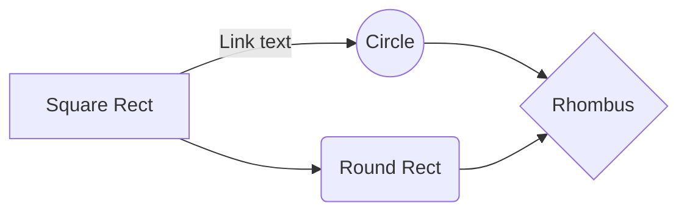

# Markdown Reference
Automatically generate _table of contents_ by checking the option here: `Settings > Format > Markdown`.

## H2 Header
### H3 header
#### H4 Header
##### H5 Header
###### H6 Header

<!-- --------------- -->

## Format Text

*Italic emphasis* , _Alternative italic emphasis_

**Bold emphasis** , __Alternative bold emphasis__

~~Strikethrough~~

Break line (two spaces at end of line)  

> Block quote

`Inline code`

```
Code blocks
are
awesome
```

<!-- --------------- -->
 
## Lists
### Ordered & unordered

* Unordered list
* ...with asterisk/star
* Test

- Another unordered list
- ...with hyphen/minus
- Test

1. Ordered list
2. Test
3. Test
4. Test

- Nested lists
    * Unordered nested list
    * Test
    * Test
    * Test
- Ordered nested list
    1. Test
    2. Test
    3. Test
    4. Test
- Double-nested unordered list
    - Test
    - Unordered
        - Test a
        - Test b
    - Ordered
        1. Test 1
        2. Test 2

### Checklist
* [ ] Salad
* [x] Potatoes

1. [x] Clean
2. [ ] Cook

<!-- --------------- -->

## Links
[Link](https://duckduckgo.com/)

[File in same folder as the document.](markor-markdown-reference.md) Use %20 for spaces!

<!-- --------------- -->

## Tables

| Left aligned | Middle aligned | Right aligned |
| :--------------- | :------------------: | -----------------: |
| Test                 | Test                      | Test                    |
| Test                 | Test                      | Test                    |

÷÷÷÷

Shorter | Table | Syntax
:---: | ---: | :---
Test | Test | Test
Test | Test | Test

<!-- Comment: Not visibile in view. Can also span across multiple lines. End with:-->

<!-- ------------- -->

## Math (KaTeX)
See [reference](https://katex.org/docs/supported.html) & [examples](https://github.com/waylonflinn/markdown-it-katex/blob/master/README.md). Enable by checking Math at `Settings > Markdown`.

### Math inline

$ I = \frac V R $

### Math block

$$\begin{array}{c} 
abla \times \vec{\mathbf{B}} -\, \frac1c\, \frac{\partial\vec{\mathbf{E}}}{\partial t} & = \frac{4\pi}{c}\vec{\mathbf{j}} 
abla \cdot \vec{\mathbf{E}} & = 4 \pi \rho \\ 
abla \times \vec{\mathbf{E}}\, +\, \frac1c\, \frac{\partial\vec{\mathbf{B}}}{\partial t} & = \vec{\mathbf{0}} \\ 
abla \cdot \vec{\mathbf{B}} & = 0 \end{array}$$


$$\frac{k_t}{k_e} = \sqrt{2}$$

<!-- ------------- -->

## Format Text (continued)

### Text color

<span style='background-color:#ffcb2e;'>Text with background color / highlight</span>

<span style='color:#3333ff;'>Text foreground color</span>

<span style='text-shadow: 0px 0px 2px #FF0000;'>Text with colored outline</span> / <span style='text-shadow: 0px 0px 2px #0000FF; color: white'>Text with colored outline</span>


### Text sub & superscript

<u>Underline</u>

The <sub>Subway</sub> sandwich was <sup>super</sup>

Super special characters: ⁰ ¹ ² ³ ⁴ ⁵ ⁶ ⁷ ⁸ ⁹ ⁺ ⁻ ⁼ ⁽ ⁾ ⁿ ™ ® ℠

### Text positioning
<div markdown='1' align='right'>

text on the **right**

</div>

<div markdown='1' align='center'>

text in the **center**  
(one empy line above and below  
required for Markdown support OR markdown='1')

</div>

### Block Text

<div markdown='1' style='text-align: justify; text-justify: inter-word;'>
lorem ipsum dolor sit amet, consetetur sadipscing elitr, sed diam nonumy eirmod tempor invidunt ut labore et dolore magna aliquyam erat, sed diam voluptua. At vero eos et accusam et justo duo dolores et ea rebum. 
</div>

### Dropdown

<details markdown='1'><summary>Click to Expand/Collapse</summary>

Expanded content. Shows up and keeps visible when clicking expand. Hide again by clicking the dropdown button again.

</details>


### Break page
To break the page (/start a new page), put the div below into a own line.
Relevant for creating printable pages from the document (Print / PDF).

<div style='page-break-after: always'></div>


<!-- ------------- -->

## Multimedia

### Images


### Videos
**Youtube** [Welcome to Upper Austria](https://www.youtube.com/watch?v=RJREFH7Lmm8)
<iframe width='360' height='200' src='https://www.youtube.com/embed/RJREFH7Lmm8'> </iframe>

**Peertube** [Road in the wood](https://open.tube/videos/watch/8116312a-dbbd-43a3-9260-9ea6367c72fc)
<div><video controls><source src='https://peertube.mastodon.host/download/videos/8116312a-dbbd-43a3-9260-9ea6367c72fc-480.mp4' </source></video></div>

<!-- **Local video** <div><video controls><source src='voice-parrot.mp4' </source></video></div> -->

### Audio & Music
**Web audio** [Guifrog - Xia Yu](https://www.freemusicarchive.org/music/Guifrog/Xia_Yu)
<audio controls src='https://files.freemusicarchive.org/storage-freemusicarchive-org/music/ccCommunity/Guifrog/Xia_Yu/Guifrog_-_Xia_Yu.mp3'></audio>

**Local audio** Yellowcard - Lights up in the sky
<audio controls src='../Music/mp3/Yellowcard/[2007]%20Paper%20Walls/Yellowcard%20-%2005%20-%20Light%20Up%20the%20Sky.mp3'></audio>

## Charts / Graphs / Diagrams (mermaidjs)
Pie, flow, sequence, class, state, ER  
See also: mermaidjs [live editor](https://mermaid-js.github.io/mermaid-live-editor/).




## Admonition Extension
Create block-styled side content.  
Use one of these qualifiers to select the icon and the block color: abstract, summary, tldr, bug, danger, error, example, snippet, failure, fail, missing, question, help, faq, info, todo, note, seealso, quote, cite, success, check, done, tip, hint, important, warning, caution, attention.

!!! warning 'Optional Title'
    Block-Styled Side Content with **Markdown support**

!!! info ''
    No-Heading Content

??? bug 'Collapsed by default'
    Collapsible Block-Styled Side Content

???+ example 'Open by default'
     Collapsible Block-Styled Side Content

------------------

This Markdown reference file was created for the [Markor](https://github.com/gsantner/markor) project by [Gregor Santner](https://github.com/gsanter) and is licensed [Creative Commons Zero 1.0](https://creativecommons.org/publicdomain/zero/1.0/legalcode) (public domain). File revision 3.

------------------

