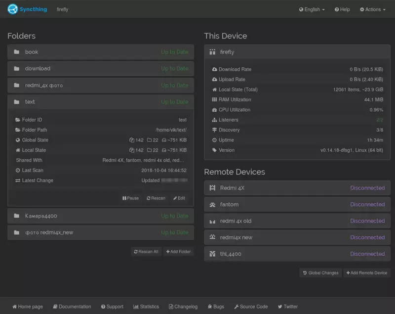
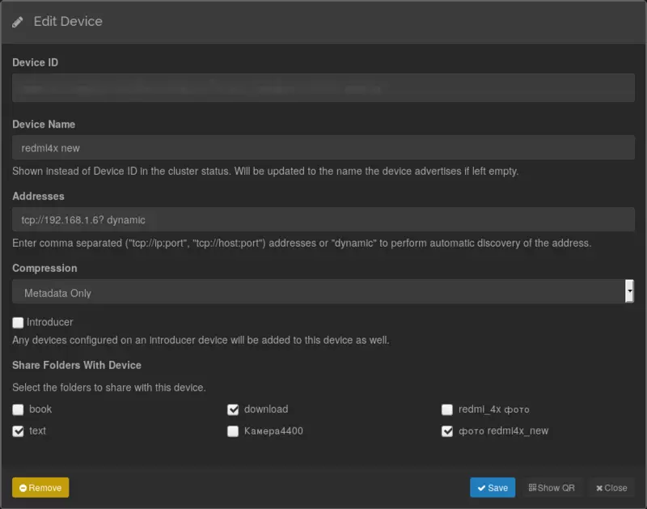
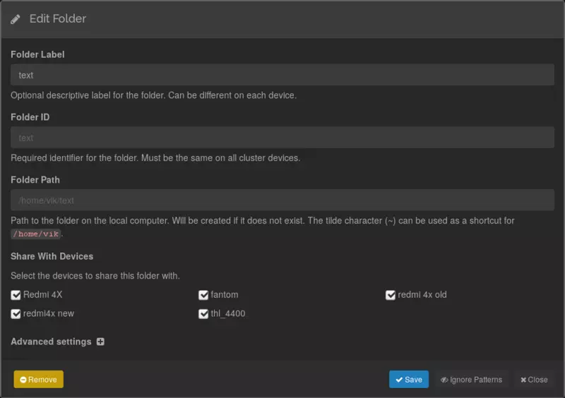
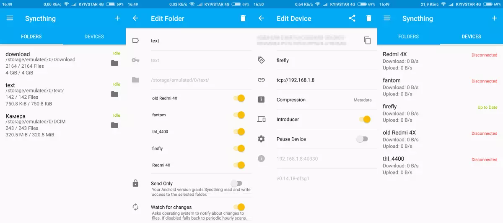
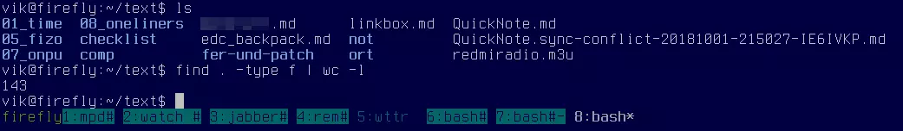

# Markor: How to synchronize files with Syncthing

This page helps you to get started using file synchronization with Syncthing and [Markor](https://github.com/gsantner/markor) as your favourite file editor of choice. Required applications are Syncthing (Desktop & Android) and Markor (Android).

## Attribution
'_I_/_me_/_myself_/_our_/_we_' refers to the original author.

* [@wmww (GitHub)](https://github.com/gsantner/markor/issues/358#issuecomment-433652981) from Markor community wrote the Quick Guide.
* [@tengucrow (GitHub)](https://github.com/gsantner/markor/issues/358#issuecomment-427037466) from Markor community wrote the Detailed Guide.

## Quick Guide
Syncthing is a protocol to sync files between your devices, with implementations for various platforms. Unlike other (even open source) sync and backup solutions, it does not require complex server setup or dependence on 3rd parties. According to their [website](https://syncthing.net/):

> Syncthing replaces proprietary sync and cloud services with something open, trustworthy and decentralized. Your data is your data alone and you deserve to choose where it is stored, if it is shared with some third party and how it's transmitted over the Internet.

To start off, install Syncthing and set up a shared folder. More info on how to do that [here](https://docs.syncthing.net/intro/getting-started.html).

Then, all you need to do is tell Marker where to look for and save files:
* Go to Markor's main screen and swipe to `More`
* Open `Settings` -> `General` -> `Notebook`
* Select the folder you sync with Syncthing (The Syncthing app tells you the default path)

## Detailed Guide

I use [Syncthing](https://syncthing.net/) - both on my desktop (Linux Debian) and on Android phone (Xiaomi Redmi 4x). Open source, privacy (my data doesn't get to the third party), etc.

I use both with local networks settings (syncing by local home wifi) since in the recent past I didn't have mobile internet, so I connect desktop (**firefly** at **192.168.1.4**) and phone (**redmi 4x new** at **192.168.1.6**).

I prefer keep separate folder for texts (`~/text` at desktop, and `~/text` aka `/storage/emulated/0/text` at phone), because syncthing sync little text files lightning fast - without having to wait for all other (big) files to be synchronized. 

For desktop linux I install syncthing by default repo (`sudo apt install syncthing`), start it and set it up via browser interface (http://127.0.0.1:8384/). I use "homebrew" selftuned Openbox install, so syncthing run at start via `~/.config/openbox/autostart.sh` (added there `(syncthing -no-browser) &`).

For android phone I get syncthing from [f-droid.org](https://f-droid.org/packages/com.nutomic.syncthingandroid/) and connect it with desktop.

Rarely I may get version conflict, but syncthing keep both version of files (see at screenshot) and I just use vimdiff.

So far - 143 files inside `~/text` :)
