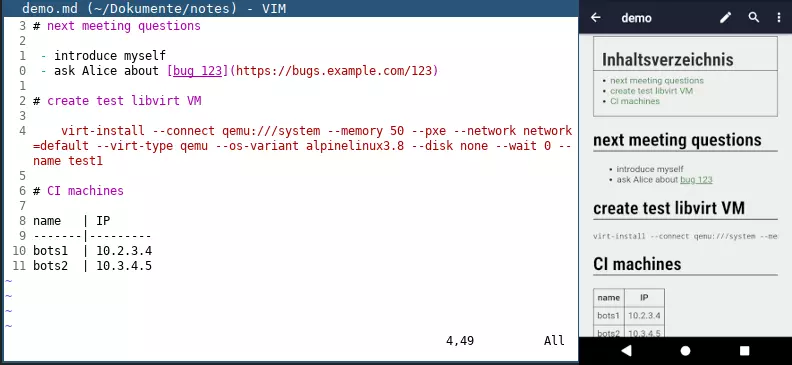
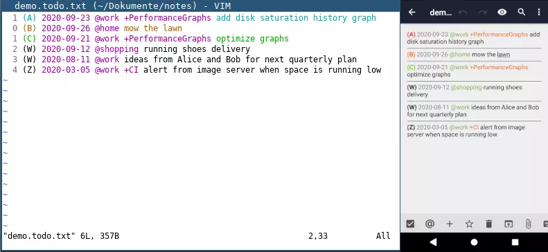

# Synced plaintext TODO and notes (Vim / Vimwiki, Markor Android, Syncthing, GTD)
_26. September 2020_

**Notice: Martin Pitt is the author of this article. It was first published on his [blog](https://piware.de/post/2020-09-26-todo-notes/) in September 2020. 'I' refers to the original author.**

----------

## Note keeping & tools


Being a paper hater, I have kept all my work and private notes in digital form pretty much forever. The tools have changed over the times of course, but I'm really happy with my current system now.

I am a strong proponent of [plain-text formats](http://plaintext-productivity.net/2-01-why-plaintext-for-notes.html) for just about everything, due to being simple, efficient, universal, implemementation/tool agnostic, and effectively trackable in revision control. I spend my entire work life as a software developer in [vim](https://www.vim.org/) and [mutt](http://www.mutt.org/), so it's just straightforward to do the same for notes and TODO lists.

Two years ago I [started to use](./2018-05-01-android-degoogle/) [org mode](https://orgmode.org/) for my notes/TODOs, with [vim-orgmode](https://github.com/jceb/vim-orgmode) on the PC, [Orgzly](https://f-droid.org/en/packages/com.orgzly/) on the phone, and [Syncthing](https://syncthing.net/) for syncing the files between my laptop, server, and phone. It works well enough, but I find the org syntax a bit unwieldy and especially hard to type on a phone. I use [Markdown](https://www.markdownguide.org/) for everything else, like software development, [scientific and computer papers](/documents/), and general documents (with [pandoc](https://pandoc.org/)).

So a few months ago I looked for an org replacment, and quickly found the FOSS Android App [Markor](https://github.com/gsantner/markor), which is just amazing. It beautifully renders and efficiently edits Markdown, [todo.txt](http://todotxt.org/), simple plaintext, and a other formats. For vim there's of course plenty of Markdown plugins, I use [vim-markdown](https://github.com/plasticboy/vim-markdown).

Thus I can easily edit some `~/Documents/notes/demo.md` file with vim on the laptop, a few seconds later Syncthing did its magic, and Markor renders it on the phone, including an autogenerated table of contents:



Markor also has a lot of shortcuts and templates for comfortably editing Markdown on the phone -- as I often do when I'm not at home.

So then I [converted my org notes to Markdown](https://orgmode.org/org.html#Markdown-Export) and never felt like going back.

## Task Management

For task management, I moved to [todo.txt](http://todotxt.org/), a well-structured and reasonably powerful, yet simple line based text format. [todo.txt-vim](https://gitlab.com/dbeniamine/todo.txt-vim) makes editing these a joy on the laptop, and Markor has excellent support for it as well:



## Getting Things Done Method

I started using the [Getting Things Done](https://en.wikipedia.org/wiki/Getting_Things_Done) method at the same time, and it has been wildly successful for me. I use:

 - Markor's QuickEdit.md as scratch pad/inbox,
 - the "next" lists go into todo.txt using priorities: A (today), B (next days), C (this week),
 - the "waiting" list is also part of my todo.txt, I use priority 'W' for that,
 - likewise the "someday" list goes into todo.txt with priority 'Z',
 - notes, extra material, and future (blocked) todo items go into `projects.md`, using the `+ProjectName` tags as headings.

I do my weekly review every Friday afternoon, at work EOD.

Finally I have some helper shell aliases for conveniently accessing my notes and TODOs:

```sh
alias notes='(cd ~/Documents/notes; vim .)'
alias todo='(cd ~/Documents/notes; vim todo.txt)'
```

The `cd` is because I often need to open more than one file, e.g. `projects.md` when I edit `todo.txt`.
