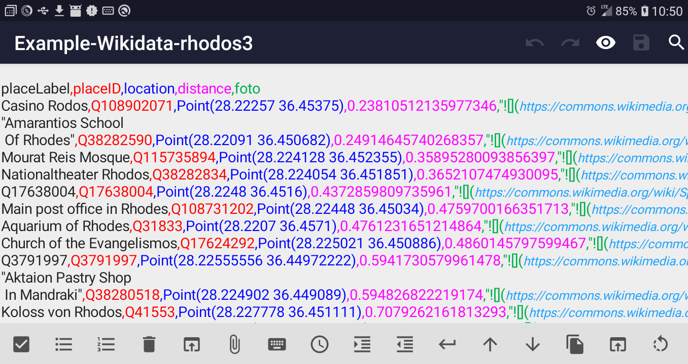
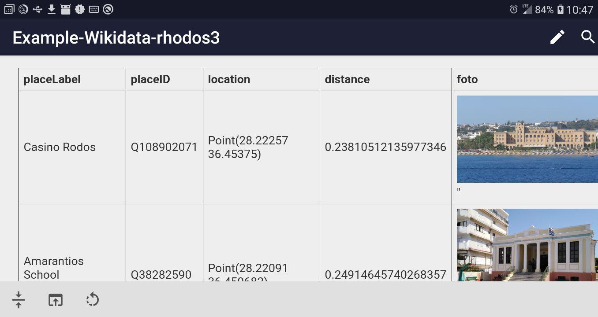

.../doc/CSV_README.md

Last updated 2023-06-02 by k3b

## Information about csv files in markor

The android editor app [markor](https://github.com/gsantner/markor)
can handle [csv](https://en.wikipedia.org/wiki/Comma-separated_values) files since version v2.10.9

### Features

* Editor with SyntaxHighlighter
  *  
  * Each csv column is shown in a different unique color to see which csv-data belongs to which colum/header
* Preview as html-Table with export as pdf
  *  
  * A csv column may contain markdown formatting like **bold** or image  
* Automatic discovering of `csv-field-delimiter-char` from found csv-header. 
  * Currently implemented: `;,:|` and `<tab>`
* Automatic discovering of `csv-quote-char` from found csv-header.
  * Currently implemented: `"'`
* empty lines are skipped
* comments: Lines that start with **`#`** that do not contain `csv-field-delimiter-char` or `csv-quote-char` are skipped.
  * Example `# this is a comment` 
* column content may or may not be sorrounded with `csv-quote-char` .
* column content must be sorrounded with `csv-quote-char` if content contains `csv-field-delimiter-char` or `<cr>` or `<nl>` .
  * Example ... `;"`A column may contain a `;` char `";` ... 
* column content may contain `csv-quote-char` : 
  * Example: `"`This text contains a `""` char`"` 

### Requirements

* csv must have a csv-header-line within the first 8000 chars of the csv
* if csv uses `csv-quote-char` = **`'`** then at least one header column name must be sourrounden by `'` 
  * `#` Example: redefining  `csv-field-delimiter-char` and `csv-quote-char` through csv-header-line
  * `'`column1`'|`column2`|`column3
